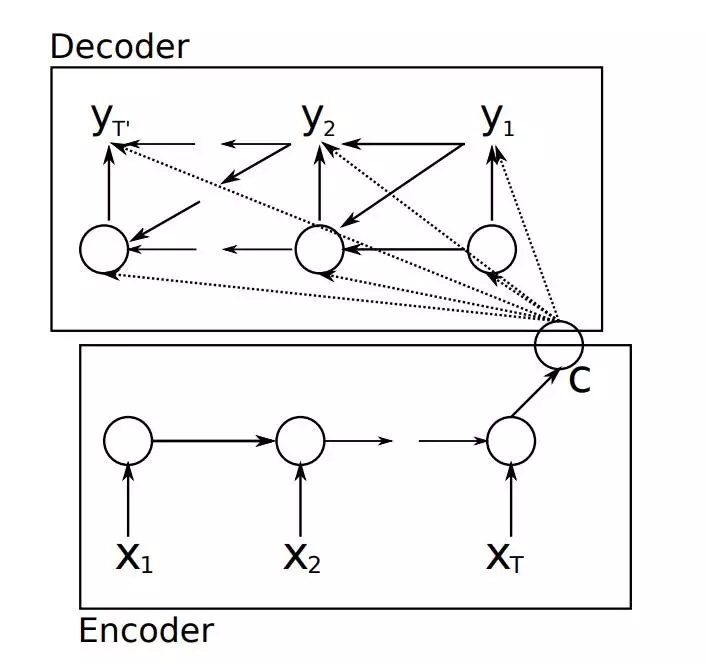
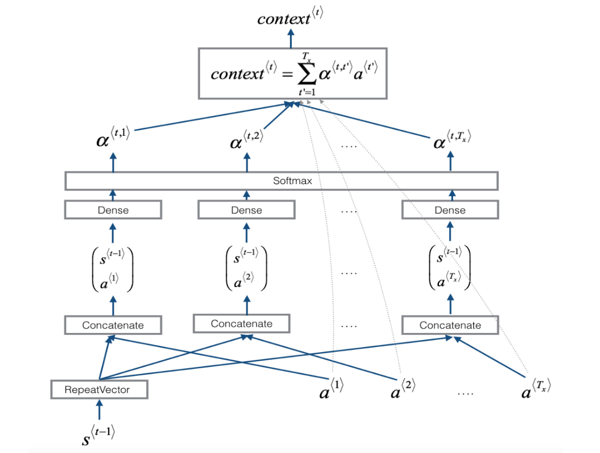

在2016年Bahdanau等人发表[论文](https://arxiv.org/abs/1409.0473)提出了注意力模型并将其运用到了机器翻译中，但这个模型被迅速推广到了其他神经网络的应用领域，这个是非常有影响力的，是一片具有开创性的论文。这篇笔记的主要内容来自这篇论文。
## RNN ENCODER-DECODER
编码-解码架构是通过encoder处理输入序列，$x=(x_1, ..., x_{T_x})$，将其转变为一个向量c，最常用的方式是使用RNN进行处理:

$$h_t=f(x_t, h_{t-1})$$

$$c=q({h_1, ..., h_{T_x}})$$

其中$h_t\in R^n$是RNN中在t时刻的隐藏状态，c是从隐藏状态的序列中计算得到的一个向量。其中f与q是非线性函数。

Decoder在训练过程中，上下文向量c与之前预测输出的所有词语${ y_1, ..., y_{t'-1}}$，作为输入来预测下一个词语 $y_{t'}$。换句话说，decoder定义了一个联合概率：

$$p(y) = \prod_{t=1}^T p(y_t|\lbrace y_1, ...,y_{t-1} \rbrace , c)$$

其中$y=({y_1, ... , y_{T_y})}$.利用RNN,每个条件概率可以如下表示：

$$p(y_t|\lbrace y_1, ...,y_{t-1} \rbrace , c) = g(y_{t-1}, s_t, c)$$

其中g位非线性函数（一般为多层，这是一个用来输出有$y_t$概率的函数），而$s_t$是RNN的隐藏状态。

总体来说，encoder-decoder架构是通过一个利用RNN将输入序列转化为一个上下文向量，然后，将上下文向量输入到decoder中，进行解码，得到目标输出。

## WHY USING ATTENTION

在自然语言处理中encoder-decoder架构中，将一整个句子编码到一个固定长度的向量中，而随着句子长度的增加，这样的策略效果特别的差，因为神经网络并不强的记忆能力，加上，所有的编码结果都被注入一个**长度有限**的上下文向量中，所以，在实际的应用过程中，例如机器翻译中，翻译短句的bleu值很高，而对长句的翻译效果就没有那么明显了。

注意力机制模仿了人对语言的处理方式，使机器像人一样对语句的各个部位有不同的注意力值，而不是整个关注句子。

注意力层位于encoder与decoder之间，在解码的时候，注意力机制将输入的语句转化成一系列向量，然后选择这些向量的一个子集来自适应的解码，而不是仅仅只利用一个上下文向量。

## ATTENTION MECHNISM
我们定义了条件概率：

$$p(i_t|\lbrace y_1, ...,y_{i-1} \rbrace , c) = g(y_{t-1}, s_t, c)$$

其中$s_i$是时序 i 时RNN的内部输入，通过下式进行计算：

$$s_i = f(s_{i-1}, y_{i-1}, c_i)$$

与普通encoder-decoder架构不同，**上下文向量 $c_i$ 会根据不同的目标输出$y_i$变化**。

上下文向量 $c_i$ 是由$（h_1,...,h_{T_x})$ 决定的。每一个注解 $h_i$ 包含了整个输入序列提供的信息，其中输入序列中第i个词以及它的周围部分得到了关注（attention)。上下文向量 $c_i$ 是注解 $h_i$ 的加权和：

$$ c_i = \sum_{j=1}^{T_x}\alpha_{ij}h_j$$

其中权重的值的计算方法是：

$$ \alpha_{ij} = \frac{exp(e_{ij})}{\sum_{k=1}^{T_x}exp(e_{ik})}$$

$$e_{ij} = a(s_{s-1}, h_j)$$
其中 $e_{ij}$ 用来score（评价）在输入序列 j 位置与输出序列 i 位置的匹配程度。score是基于decoder中RNN的隐藏单元 $s_{i-1}$ 与输入语句的第 j 个注解 $h_j$。

我们可以把 $\alpha_{ij}$ 看做目标输出 $y_i$ 在给定输入$x_j$时被分配的概率，这样，第 i 个上下文向量 $c_i$ 则是所有概率为 $\alpha_{ij}$ 的 $h_j$的加和。概率 $\alpha_{ij}$ 或者与其关联的 $e_{ij}$，反应了在决定下一个状态 $s_i$ 和产生输出 $y_i$时，encoder中的$h_j$与decoder中前一个状态 $s_{i-1}$ 起到了重要的作用。从直觉上，decoder能够决定输入句子中的哪一部分能够受到关注，而且decoder不再使用一个维度有限的上下文向量，而是在产生不同输出时使用不同的上下文向量。这样，我们也将长句中编码到一个有限长度的向量中解放出来。

## WHAT'S MORE

attention机制的提出，在自然语言处理方面引起了巨大的反响，这个机制也被引入了计算级视觉等领域，是深度学习中最重要的一个机制。

随后，attention机制出现了很多变种与分类。

1. *soft attention*: 即上述的attention机制，soft attention是参数化的，所以是可导的，可以直接嵌入到模型中，允许代价函数的梯度进行方向传播（backpropagation）。
2. *hard attention*: 这种注意力机制不会选择整个encoder的注解向量 $（h_1，...,h_{T_x})$ 作为输入，而是通过概率来采样输入端的一部分来进行计算，在反向传播的过程中，需要进行蒙特卡洛采样。

3. *local attention*: 这是Kelvin Xu提出的一种将soft与hard attention结合起来的注意力机制，即采用一部分的encoder的注解向量。local attention会在decoder端输出一个词时预测一个encoder端的对齐位置 $p_t$ ,然后基于 $p_t$　选择一个窗口，用于计算上下文向量$c_t$。

4. 除此之外，还有*self attention*,*multi-head attention*, *hierarchical attention*, *双向注意力机制*　等等，我最近也在看这些论文　＝＝

## END 
注意力机制初略得看起来有点复杂，但是读完论文会发现这是一个十分简洁的方法，而且它带来的改变是十分巨大的。
每一个有影响力的新理论，都是简洁的。