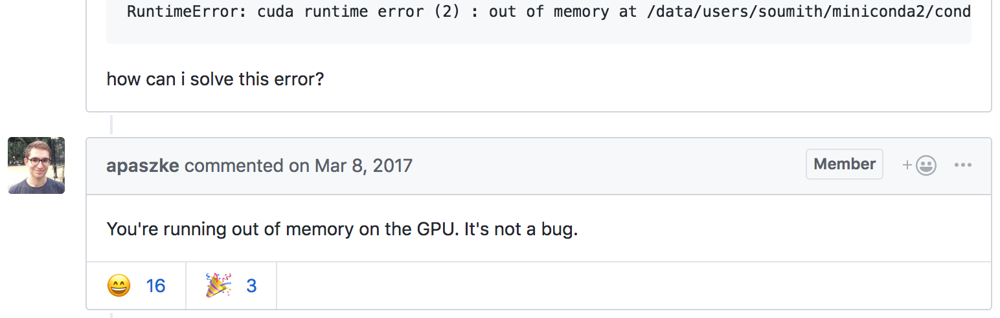
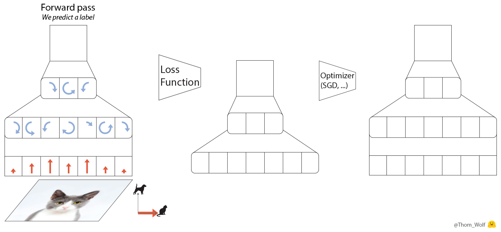
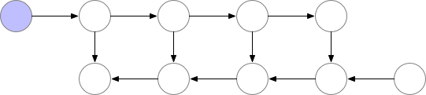
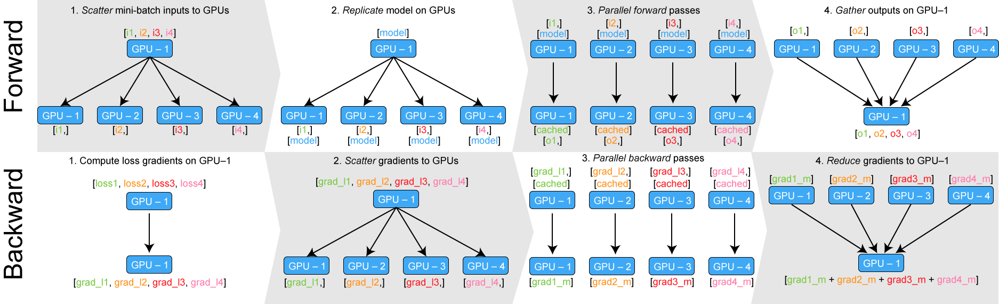
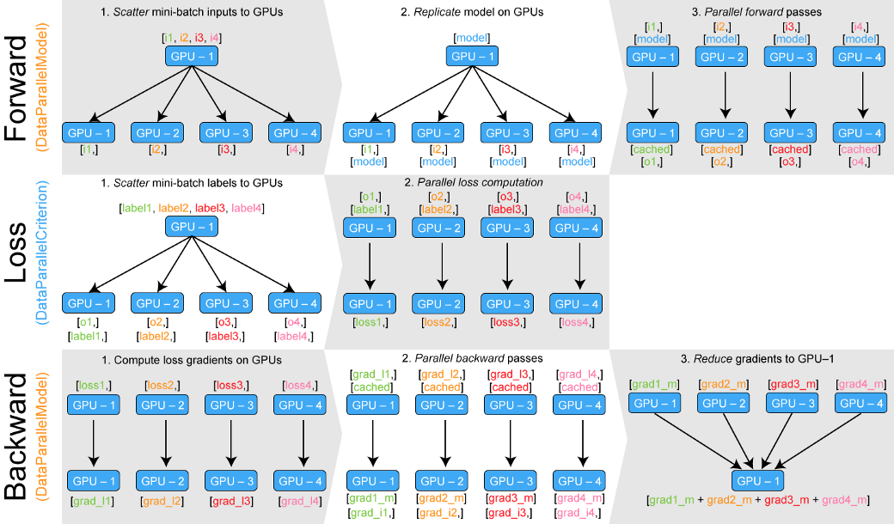
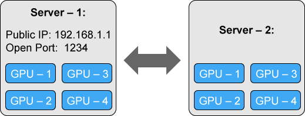

一篇翻译 文章版权归原作者所有

原文地址：[Training Neural Nets on Larger Batches: Practical Tips for 1-GPU, Multi-GPU & Distributed setups](https://medium.com/huggingface/training-larger-batches-practical-tips-on-1-gpu-multi-gpu-distributed-setups-ec88c3e51255)


作者：[Thomas Wolf](https://medium.com/@Thomwolf)

***

我几乎花了2018年一年的时间来解决我的GPU带来的限制。不管是有一亿五千万个参数的语言模型，例如[OpenAI的生成预训练的Transformer模型](https://blog.openai.com/language-unsupervised/)（或者最近出来的相似的[BERT模型](https://arxiv.org/abs/1810.04805)）或者一个有三千万个元输入的元学习神经网络比如我们的[ICLR '18论文](https://medium.com/huggingface/from-zero-to-research-an-introduction-to-meta-learning-8e16e677f78a)，在我的GPU上几乎不能容纳几个训练样本。

但是大多数时候，为了获得更好的结果，随机梯度下降算法需要跟大的batch，而不仅仅是少数的几个样本。

> **当GPU无法容纳多个样本时，如何在大批量上训练模型呢？**

这里有几种工具、技巧和窍门来做到这一点，我认为我把所有我使用和学到的东西放在一个帖子力会更好。

这篇文章中，我会主要讲**PyTorch 框架**，其中有一些工具还没有包含在PyTorch中，所以我也写了一些自定义代码，特别的，我们会讨论到：
- 如何在单个GPU或者多个GPU中训练batch比GPU内存更大的模型，或者即使单个训练样本也不适合(!)
- 如何充分利用一个多GPU的机器
- 使用多台机器训练模型的分布式设置的最简单的方法

让我们以最简单的技巧开始：梯度积累

## ⌛ Large batches on one or several GPUs
所以当你构建了一个很好的模型，这个模型可能是在这个整洁的任务上最新的SOTA(最先进的模型 state-of-the-art)，但是每一次你打算讲一些样本堆叠到一个batch里的时候，你得到了一个CUDA RuntimeError:out of memory.



但是你又十分肯定将batch size加倍，会提高你的结果。

**你会怎么办？**

解决这个问题有一个最简单的方法：梯度积累(accumulating gradients)，这里有一张图来对随机梯度下降做一个简要的提示。



PyTorch代码中等同与这五个步骤的过程可以写成五行代码：

```python
predictions = model(inputs) # Forward pass
loss = loss_function(predictions, labels) # Compute loss function
loss.backward() # Backward pass 
optimizer.step() # Optimizer step 
predictions = model(inputs) # Forward pass with new parameters
```
在```loss.backward()```操作中，每个参数的梯度（动图中的绿色部分）d都会被计算，并被储存在与每个参数相关的张量中：```parameter.grad```(动图中的中间部分)

梯度积累的意思是，在调用```optimizer.step()```来实现一次梯度下降之前，我们将在```parameter.grad```中的张量中对几次后向过程的梯度求和。这在PyTorch中实现起来是十分简单的，因为梯度的张量在调用```model.zero_grad()```或者```optimizer.zero_grad()```之前是不会被重置的。如果我们的损失函数是在样本上平均，那么我们还需要除以累积步骤的步数。

这是使用梯度积累训练模型的简单要点。在这个例子中，我们可以训练的batch size为accumulation_steps——这比适合与我们的GPU的最大大小更大。

```python
model.zero_grad() # Reset gradients tensors
for i, (input, labels) in emumerate(training_set):
    predictions = model(inputs)
    loss = loss_function(predictions, labels)
    loss = loss / accumulation_steps
    loss.backward()
    if (i+1) % accumulation_steps == 0: # wait for several backward steps
        optimizer.step() # do an optimizer step 
        model.zero_grad() # reset gradients tensors
        if (i+1) % evaluation_steps == 0:
            evaluate_model()
```
Grzegorz Chlebus 在一篇帖子中详细的描述了Tensorflow中的梯度积累方法怎么做，点击[这里](https://gchlebus.github.io/2018/06/05/gradient-averaging.html)查看。

## 😱 Pushing that to the extreme
你能训练甚至连单个样本都不能放在GPU上的模型吗？

如果你的架构没有太多的残差链接，是的，它是可能的！解决方案是使用梯度检查点(gradient-checkpoint)来交换计算内存。

因此，我们的想法是沿着模型以小块(chunk)的形式反向传播梯度，交换存储完整的反向传播图的内存，以及每个块之间相关联部分的正向传播的附加计算。这是一个相当慢的方法,因为我们添加额外的计算以减小内存需求，但是在某些设置中，它可能是很有趣的。例如，在长序列上训练RNN模型（查看作者以前写的一个例子[introduction to meta-learning](https://medium.com/huggingface/from-zero-to-research-an-introduction-to-meta-learning-8e16e677f78a))

我不会在这里十分深入的讲，我会提供给你两条相关的链接：

- TensorFlow:  https://github.com/openai/gradient-checkpointing
- PyTorch doc:
https://pytorch.org/docs/stable/checkpoint.html




## 🕰 Making the best of a multi-GPU machine 
现在让我们谈论一些在多个GPU上训练模型更具体的事。

在多GPU上训练PyTorch模型的首选策略是使用```torch.nn.DataParallel```，它是一个容器，它通过在指定设备上拆分输入，沿着batch维度进行分块来并行化模块的应用程序。

DataParallel使用起来很简单，我们只需要使用能够一行代码来封装模型：

```python
parallel_model = torch.nn.DataParallel(model)  # encapsulate
predictions = parallel_model(inputs)
loss = loss_function(predictions, labels)
loss.mean().backward()  #average GPU-lossed + backward pass
optimizer.step()
predictions = prallel_model(inputs)
```

然而使用DataParallel会出现一个问题：**不平衡的GPU使用**

在一些设置下GPU-1会比其他GPU使用得多得多。

这是为什么呢？为了更好的解释DataParallel的运行原理，我做了一个说明：



在前向计算第四步（右上）期间，所有并行计算的结果都聚集在GPU-1，这对于很多分类问题来说是可以的，但是在训练batch很大的语言模型的时候，就可能出现一些问题。

让我们快速的计算一下语言模型的输出大小：

$$ Vocabulary\_size * Sequence\_length * Samples\_per \_batch $$

假设我们有40k个词汇，序列中有250个字符，一个batch中有32个样本，如果每个元素在内存中存储需要4个字节，那么我们的模型的输出大约有1，2GB。我们需要把这个数字加倍因为我们需要同样大小的空间来储存梯度张量，**我们的模型输出需要2，4GB的内存！**

这是一个典型的10GB的GPU内存里很显著的一部分了，这意味着对于其他GPU来说，GPU-1会被过度使用，这限制了并行化的效果。

如果不调整模型或者优化方案，我们无法简单地减少此输出中元素的数量。但是我们可以确保内存负载更均匀的分布在GPU之间。

## ⚖️ Balanced load on a multi-GPU machine
有两种不平衡的GPU使用问题的解决方案：
- 在模型的前向计算中计算损失函数
- 以并行的方式计算损失

第一种选择是最简单的但是有时你不能使用或者出于各种原因，这是不切实际的（比如，你的前向计算因为Python的GIL变得很复杂或者缓慢），所以让我们讨论一下第二种解决方案。沿着这个思路，我们会学习到很多PyTorch多GPU模块如何工作的有趣细节。

在这种情况下，解决方案是将每个部分输出保存在自己的GPU上而不是把它们聚集在GPU-1上。我们需要分配我们的损失标准计算，以便能够计算并反向传播我们的损失。

值得庆幸的是，Hang Zhang开源了一个名为[PyTorch-Enconding](https://github.com/zhanghang1989/PyTorch-Encoding)的包,它包括了自定义并行化功能。

我已经提取并略微调整了这个模块，你可以在[这里](https://gist.github.com/thomwolf/7e2407fbd5945f07821adae3d9fd1312)下载这个gist并把它包含在你的代码中，并调用它。它主要包含两个模块：```DataParallelModel```和```DataParallelCriterion```，它们可以像下面一样被使用：

```python
from parallel import DataParallelModel, DataParallelCriterion

parallel_model = DataParallelModel(model)
parallel_loss = DataParallelCriterion(loss_function)

predictions = parallel_model(inputs)
loss = parallel_loss(predictions, labels)
loss.backward()
optimizer.step()
predictions = parallel_model(inputs)
```

其中```DataParallelModel```与```torch.nn.DataParallel```的不同只是前向计算的输出不会聚集在GPU-1上，前者输出是一个n_gpu个张量的元组，每一个张量都分布在不同的GPU上。

DataParallelCriterion封装了损失函数，将n_gpu张量的元组和target标签张量作为输入。它并行的计算了每一个GPU上的损失函数，分割target标签张量的方式与模型输入被DataParallel分块的方式相同。

我做了一个*DataParallelModel/DataParallelCriterion*内部的说明图：



这里是如何解决你可能遇到的两个特殊情况：
- 你的模型输出多个张量：你可能想要解开它们：```output_1, output_2 = zip(*predictions)```
- 有时你不想使用一个并行的损失函数：将所有的张量聚集在一个GPU上： ```gathered_predictions = parallel.gather(predictions)```

# ⏰ Distributed training:training on several machines
现在我们如何利用多台服务器的强大功能来进行更大规模的训练？

最简单的选择是使用PyTorch DistributedDataParallel（PyTorch自带的模块torch.nn.parallel.DistributedDataParallel），这应该是对我们上述讨论的DataParallel最直接的替换。

注意：尽管代码看起来很相似，但是在分布式设置中训练模型将改变你的工作流程，应为你实际上必须在每个节点上启动一个独立的python训练脚本（这些脚本都是相同的）。正如我们看到的那样，一旦开始，这些训练脚本将会由PyTorch分布式后端所同步。

在实践中，这意味每个训练脚本有：
- ＊*自己的优化器**而且每次迭代都执行一个完整的优化步骤，不需要参数广播。
- 一个独立的python解释器：这也会避免在单个python解释器中驱动多个并行执行线程所带来的GIL冻结。

当单个解释器驱动多个并行的前向计算调用时，python解释器的GIL会减慢大量使用Python循环／调用其前向计算的模型，在这些设置中，即使在单个机器的设置中，DistributedDataParalllel也可以有利地替换DataParallel。

现在我们直接介绍代码和用法。

> DistributedDataParallel是构建在torch.distributed包之上的，该包提供用于同步分布式操作的低级基础，并且可以使用具有不同功能的多个后端（tcp, gloo, mpi, nccl)

在这篇文章中，我将选择一种简单的方法来开箱即用，但是你应该[阅读文档](https://pytorch.org/docs/stable/distributed.html)以及阅读一篇Seb Arnold写的[很好的教程](https://pytorch.org/tutorials/intermediate/dist_tuto.html)来深入了解这个模块。

我们会考虑一个简单但是通用的有两个4-GPU服务器（节点）的设置：



## 🏃 Adapting our Python training script for distributed training
首先我们需要将我们的脚本修改一下，这样它们才能在每个机器（节点）上运行。我们实际上将完全分布并为每个节点的每个GPU运行一个单独的进程，因此总共有8个进程。

我们的训练脚本会变得更长一点因为我们需要初始化分布式后端来实现同步、封装模型和处理训练数据，从而能够在单独的数据子集上训练每个进程（每个进程是独立的，所以我们需要关心每个进程处理不同的数据集切片），这里是更新后的代码：

```python
from torch.utils.data.distributed import DistributedSampler
from torch.utils.data import DataLoader

# Each process runs on 1 GPU device specified by the local_rank argument.
parser = argparse.ArgumentParser()
parser.add_argument("--local_rank", type=int)
args = parser.parse_args()

# Initializes the distributed backend which will take care of sychronizing nodes/GPUs
torch.distributed.init_process_group(backend='nccl')

# Encapsulate the model on the GPU assigned to the current process
device = torch.device('cuda', arg.local_rank)
model = model.to(device)
distrib_model = torch.nn.parallel.DistributedDataParallel(model,
                                                          device_ids=[args.local_rank],
                                                          output_device=args.local_rank)

# Restricts data loading to a subset of the dataset exclusive to the current process
sampler = DistributedSampler(dataset)

dataloader = DataLoader(dataset, sampler=sampler)
for inputs, labels in dataloader:
    predictions = distrib_model(inputs.to(device))         # Forward pass
    loss = loss_function(predictions, labels.to(device))   # Compute loss function
    loss.backward()                                        # Backward pass
    optimizer.step()                                       # Optimizer step
```

## ✨ Launching multiple instances of our Python training script

我们几乎要完成了，我们只需要在每个服务器上开始运行我们的训练脚本就行了。

> 为了运行我们的脚本，我们需要使用```torch.distributed.launch```工具，它会使管理设置环境变量，以及每次会以正确的```local_rank``参数来运行脚本。

第一台机器是我们的master机器，其他的所有机器应该能够访问到它，所以它有一个可达的IP地址（我们的例子中是192.168.1.1），而且应该开放一个端口（我们的例子是1234）。在我们的第一台机器上，我们使用```torch.distributed.launch```运行我的训练脚本:

```shell
python -m torch.distributed.launch --nproc_per_node=4 --nnodes=2 --node_rank=0 --master_addr="192.168.1.1" --master_port=1234 OUR_TRAINING_SCRIPT.py (--arg1 --arg2 --arg3 and all other arguments of our training script)
```

相似的，在第二台机器上运行脚本：
```shell
python -m torch.distributed.launch --nproc_per_node=4 --nnodes=2 --node_rank=1 --master_addr="192.168.1.1" --master_port=1234 OUR_TRAINING_SCRIPT.py (--arg1 --arg2 --arg3 and all other arguments of our training script)
```
这两个命令是完全一样的除了```--node_rank```参数在第一台机器上被设置为0，而在第二台机器上被设置了为1（该参数依次增加，如果有额外的服务器）

在一组机器上运行一堆几乎相同的命令的过程可能看起来有点单调乏味。所以现在可能是了解GNU并行的魔力：

<iframe width="560" height="315" src="https://www.youtube.com/embed/OpaiGYxkSuQ" frameborder="0" allow="accelerometer; autoplay; encrypted-media; gyroscope; picture-in-picture" allowfullscreen></iframe>

PyTorch v1.0在分布式模块中添加了c10d后端，这是一个让人激动的更新。我会更新这个简短的入门教程当v1.0更新之后，并提供更多的详细信息🔥 （事实上现在PyTorch已经更新到1.0了，但是作者没有更新）

***