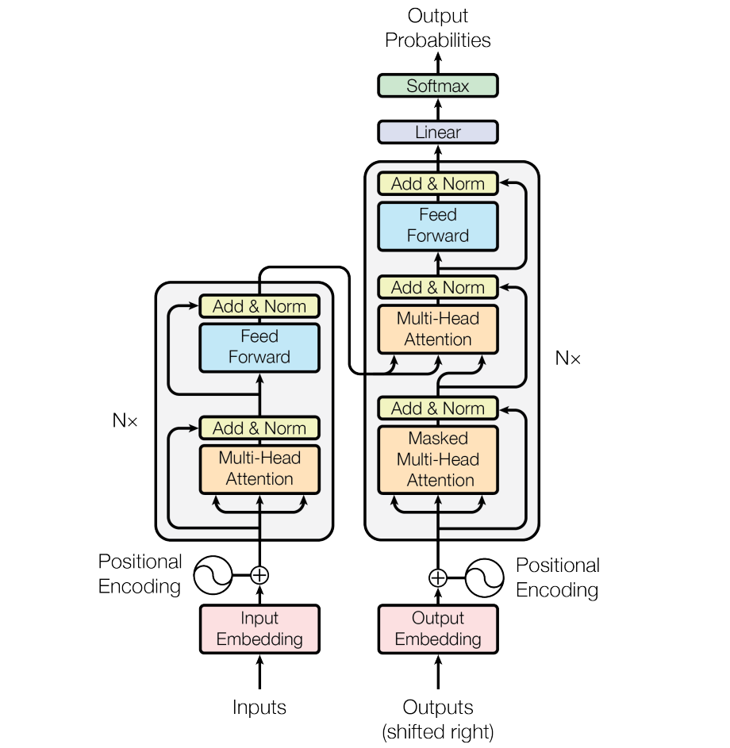
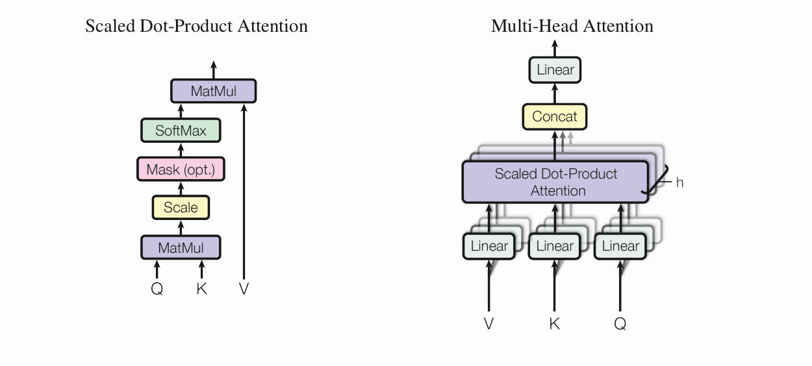

谷歌发布 **BERT** 之后就开始关注这个话题，然后想阅读一下那篇论文，BERT是基于双向Transformer 的大规模训练语言模型。但是我之前一直没有接触过Transformer 这种网络结构，于是就读了一下相关论文与代码。Transformer 是谷歌提出的一种机器翻译架构，用来取代传统的RNN的编码解码方式，这篇笔记是在阅读谷歌在arXiv 上发表的论文 [《Attention is all you need》](https://arxiv.org/abs/1706.03762) 后写的。
# BACKGROUND
*为什么不直接使用 RNN 做为编码解码的基本结构呢？*

循环神经网络通常将沿着输入与输出序列的符号位置信息作为计算的考虑因素。将位置与计算时间步对齐，循环神经网络会产生一系列的隐藏状态 $h_t$,都是先前隐藏状态 $h_{t-1}$ 与位置 t 的函数，这就意味着这种顺序性质从本质上排除了训练样本时的**并行化**。

*Transformer 主要使用了什么结构来编码呢？*

正如论文题目**attention is all you need**， 在构建新的编码、解码架构时，注意力机制在其中起到了主要作用。自注意力机制(self-attention)，有时被称为内部注意力，计算一个序列的表示，它会把单个序列的不同位置关联起来。

# MODEL ARCHITECTURE

Transformer 使用堆叠的自注意力机制和 point-wise 的全连接层作为架构的最主要的组件，其网络结构如下图所示：

## 1 Encoder and Decoder Stacks

**Encoder:** 编码器是由 $N=6$ 个相同的层堆叠而成，每一层是由两个次层 (sub-layer) 组成。
- 第一个次层是一个multi-head自注意层
- 第二个次层是由全连接层组成。 
- 每一个次层都会使用一个残差连接，紧接一个归一化层。也就是说，每一个次层的实际输出是：

$$ LayerNorm(x + Sublayer(x)) $$

所有次层的输出维度$d_{model} = 512$

**Decoder:** 解码器同样是由 $N=6$ 个相同的层堆叠而成，与编码器不同的是，解码器多了一个次层，它的三个次层是：
- 第一个次层是一个masked multi-head attention
- 第二个次层是multi-head自注意力层，它会同时接收encoder的输出作为输入
- 第三个次层是全连接层

与 encoder 一样，每个次层都会紧接一个归一化层，以及使用残差连接。

## 2 Attention

Attention 可以被描述为将一组key-value对和query映射到输出，其中keys、values、query都是向量。输出是values的加权和，其中的分给每个value的权重是由query与相关的key的兼容性函数来计算。

Attention 具体的结构如下：

**Scaled Dot-Product Attention:**

$$ Attention(Q, K, V) = softmax(\frac{QK^T}{\sqrt{d_k}})V$$

queries 与 keys 的输入维度为 $d_k$；

**Multi-Head Attention:**

$$ MultiHead(Q, K, V) = Concat(head_1, ..., head_h)W^O $$

where

$$ head_i = Attention(QW_i^Q, KW_i^K, VW_i^V) $$\

其中 $W_i^Q \in R^{d_{model}*d_k}, W_i^K \in R^{d_{model} * d_k}, W_i^V \in R^{d_{model}*d_v}, W^O \in R^{hd_v * d_{model}}$

在这个结构中，$h=8$并行的注意力层（或者说head）, 在每个head中, $d_k = d_v = d_{model}/h = 64$。

## 3 Applications of Attention in Model

Transformer 使用多头注意力（multi-head attention）在这三个方面：
- 在“encoder-decoder attention”层中，queries来自前一个decoder层， keys 和values 来自encoder的输出，这允许decoder的每个位置都能够照顾到输入序列的所有位置。这与典型的encoder-decoder注意力机制是一样的。
- encoder中包含自注意力层，在自注意力层中所有的keys、values、queries 来自同一个地方--来自encoder 中前一层的输出。encoder每一个位置能够照顾到前一层的所有位置。
- 相似地，在decoder中自注意力层允许decoder中每个位置能够照顾到decoder中该位置及该位置之前的所有位置。我们需要阻止decoder中向左的信息流来保持自回归性质。我们通过屏蔽softmax输入中与非法连接相对应的所有值，将这些值设置为$-\infty$。

## 4 Position-wise Feed-Forward Networks

其中包含两个线性变换，在两个线性变换中间由一个ReLu激活函数：

$$ FFN(x) = max(0, xW_1 + b1)W_2 + b_2$$ 

另一种描述这个层的方式是做了两次kernel size为1的一维卷积，输入与输出维度为$d_{model} = 512$， 在两层之间为$d_{ff} = 2048$。

## 5 Embedding and Softmax

与其他编码解码结构一样，我们使用训练的embedding层来将我们的输入和输出字符转化成$d_{model}$ 维的向量。我们同样使用线性层(Linear)与softmax层来将解码器的输出转化成下一个预测字符的概率。在这个模型中，我们使用的两个embedding层，以及softmax前的线性层的权重矩阵是相同的，在embedding层，我们将这些权重矩阵乘以$\sqrt{d_{model}}$。

## 6 Positional Encoding 

与RNN作为编码解码器的基本结构不同，利用attention没有传递位置信息，我们必须向我们的结构中注入输入序列中词语的相对与绝对位置信息。
可以使用正弦或余弦函数来做位置编码：

$$PE_{(pos, 2i)} = sin(pos/10000^{2i/d_{model}}) $$

$$PE_{(pos, 2i+1)} = cos(pos/10000^{2i/d_{model}}) $$

# WHY SELF-ATTENTION
上面我们把Transformer的结构简述了一下。
**但是我们为什么要使用自注意力机制呢？**

文献中用下面三个指标来衡量了各种编码解码结构的不同：

- 每一层中计算复杂度(complexity per layer)
- 可以并行化的计算量，通过所需的最小顺序操作数来衡量(sequential operations)
- 网路中远程依赖之间的路径长度(maximum path length)，其值越小，网络越容易学习远程依赖。

|Layer Type|Complexity per Layer| Sequential Operations| Maximum Path Length|
|:--:|:--:|:--:|:--:|
|Self-Attention|$O(n^2d)$|$O(1)$|$O(1)$|
|Recurrent|$O(nd^2)$|$O(n)$|$O(n)$|
|Convolutional|$O(knd^2)$|$O(1)$|$O(log_k(n))$|
|Self-Attention(restricted)|$O(rnd)$|$O(1)$|$O(n/r)$|

n为序列长度， d为表示维度（representation dimensionality），k为卷积的kernel size， r为restricted attention的邻居大小

通常来说，当输入序列长度n小于表示维度d时，自注意力比循环神经网络的计算复杂度小的多，实际情况下，n一般会小于d,所以自注意力的计算复杂度较小，而且它的课并行化计算量更小，也就是说，在这两个方面，自注意力都会比RNN好。同时自注意力机制还有很小的远程依赖长度，说明它学习远程依赖的能力比较好。

# TRAIN 
在论文中，详细的描述了Train需要的优化器、超参数，以及一些正则化的方法，包括**residual dropout**与**label smoothing**

# THE END
最后的一些链接：
- 论文地址[《Attention is all you need》](https://arxiv.org/abs/1706.03762)
- 一个详解transformer的博客: [illustrated transformer](http://jalammar.github.io/illustrated-transformer/)
- 谷歌的开源代码： [Tensor2Tensor repo](https://github.com/tensorflow/tensor2tensor)
- 一个pyTorch实现：[attention-is-all-you-need-pytorch](https://github.com/jadore801120/attention-is-all-you-need-pytorch)

发现自己写一下博客的确能加深一点理解，虽然都是翻译，没有用自己的话写出来。

