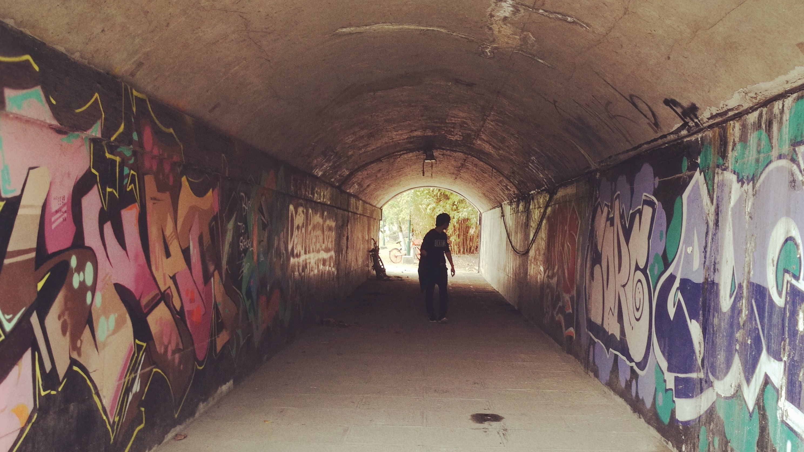
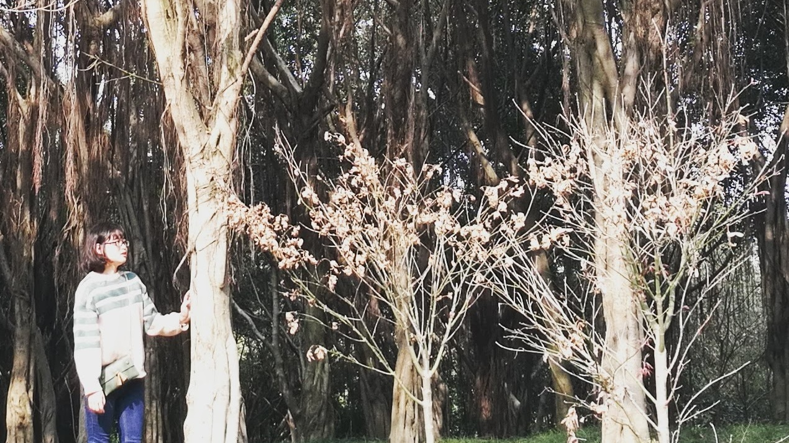
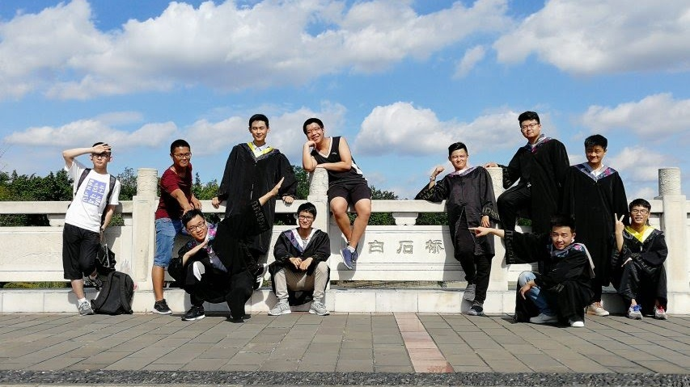
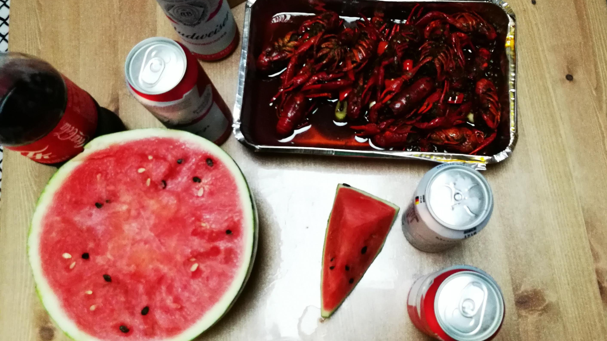
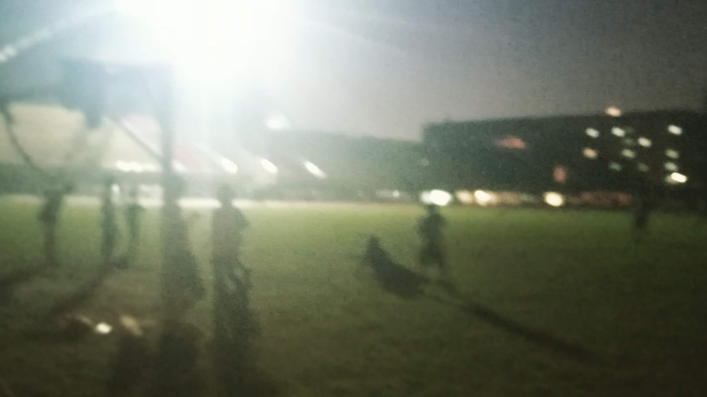
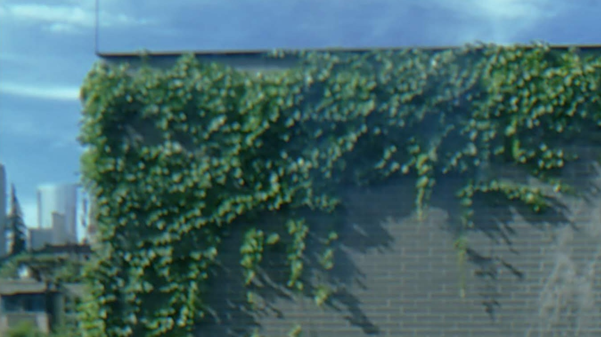
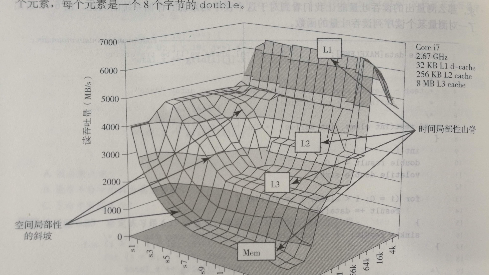
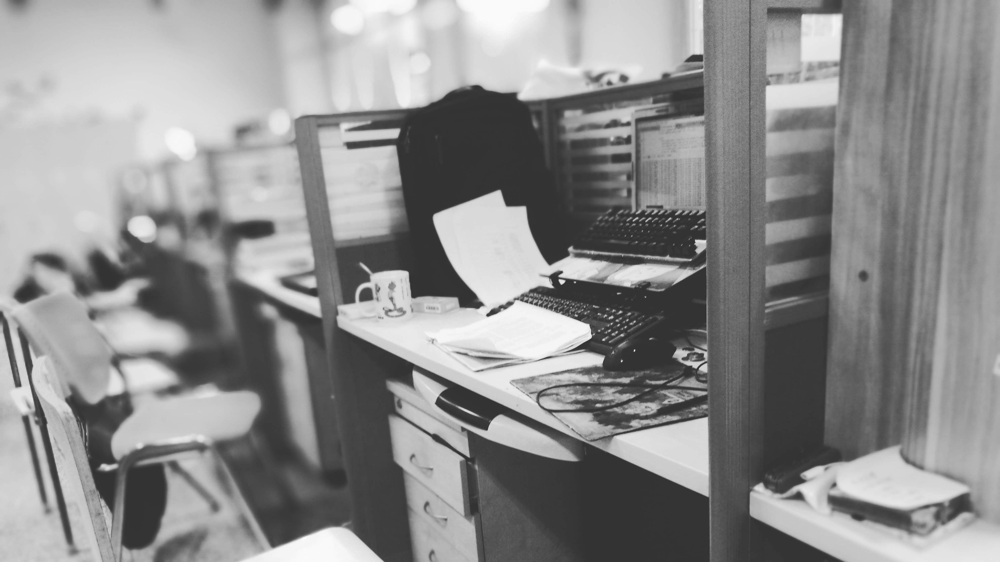
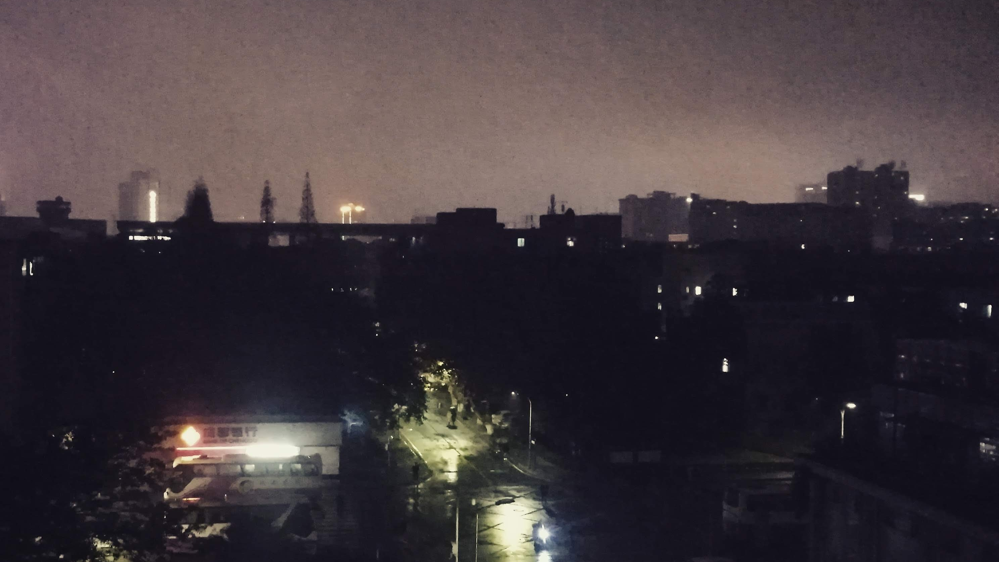

对于每个人来说，2018都有相对于他的独特的意义。但不管时间怎么"意义深远"的改变一个人，当2018年成为过去时，它只是成为了我纷繁回忆中一个平凡的去年。

我从我的云盘中选了9张我的2018图片。

## WHEN YOU MEET SOMEBODY
2018年是重新遇见的一年。

2018与四年前一样，遇到了你，但是是一个崭新的你。

2018年的上半区，都有你的陪伴。

## WHEN YOU GRADUATE

2018年结束了我的大学生涯，像一个时代的结束。毕业季拍了太多的照片。

高中毕业时，大家都奔向五湖四海，但都有同一个故乡。而大学，大家来与去的地方都叫五湖四海。

因为我们寝室四人全员升学，毕业的两天是最无忧无虑的两天。

## WHEN YOU WANDER

没有毕业旅行

我在操场上跑了一个暑假，几乎每天晚上。

今年暑假，我没有回家，取而代之的是图书馆与兼职。

文理馆三楼窗外的爬山虎，我喜欢文理馆三楼的走廊，在夏天，我在那写毕业论文，也在那学习写代码。

我害怕从高分子到计算机的专业改变把我淹没，我也害怕非科班对研究生的影响。

我对这个夏天难以释怀。不论是家庭撕裂还是生活变化。

## WHEN YOU BRUST INTO SOMETHING NEW

这个下半年，是一个新的起点。

同系同学保研时说，你为什么不发邮件给计算机学院的老师呢。

一句话却真的改变了我。

我也不知道我为什么要拍下面这张照片，但是2018的下半区，没有特别的精彩，每天看论文，上课，日复一日。

在圣诞节的晚上，我在阳台上的随手一拍，很冷，那天晚上有很多人在阳台打电话，我也是。

***

2018年真的要过去了。

我认真的翻了一下google photos，发现没有一张照片是值得说很久的，可能是因为我不太会拍照片。我只能说这是很平凡的一年。但是却真真切切的改变了我对很多事情的看法。

希望在2019年，能够活的更精彩。