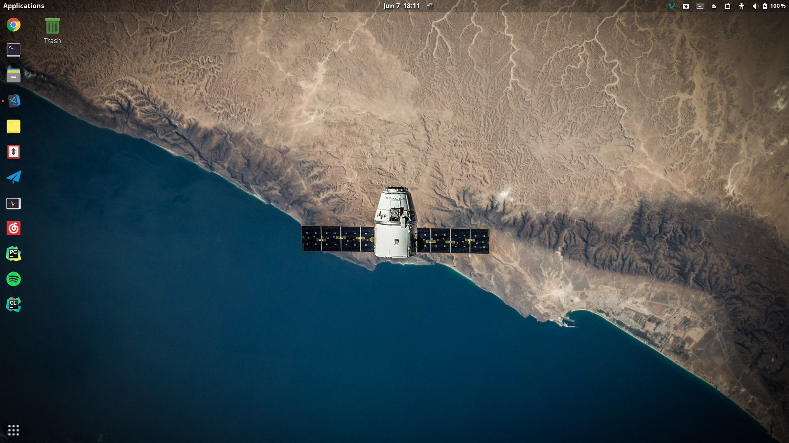

买了一块新固态之后，尝试过deepin、manjaro等linux系统，但是最终还是使用了ubuntu，因为不想折腾，写一个ubuntu 19.04使用备忘吧，防止哪一天手抽又重装了系统。



# 安装完成之后

安装完成之后首先去软件更新中切换apt源为中国源。

## 解决双系统时差问题

```bash
timedatectl set-local-rtc 1 --adjust-system-clock
```

## 替换终端

使用zsh并用oh-my-zsh配置：

```bash
sudo apt install git
sudo apt install zsh
wget https://github.com/robbyrussell/oh-my-zsh/raw/master/tools/install.sh -O - | sh
chsh -s /usr/bin/zsh
```

## 输入法

使用搜狗输入法。安装Fcitx并在系统输入法设置中替换ibus,然后安装搜狗输入法。

## 切换显卡驱动
自动安装推荐的nvidia驱动

```bash
ubuntu-drivers devices
sudo ubuntu-drivers autoinstall
```

# 软件安装备忘

优先使用snap安装软件，因为snap更简洁与快速。

替换snap的代理设置：
```bash
sudo systemctl edit snapd 
# 加上,下面三行 
# [Service]
# Environment="http_proxy=代理"
# Environment="https_proxy=代理"
# 保存后退出

systemctl daemon-reload
syatemctl restart snapd
```

## 从windows切换

寻求linux下的windows常用应用的替代品

- TIM与微信

使用[deepin-wine-ubuntu](https://github.com/wszqkzqk/deepin-wine-ubuntu)安装与设置TIM。

- 办公

使用[WPS](https://www.wps.cn/)代替office， [edraw Max](http://www.edrawsoft.cn/linuxdiagram/)代替Visio. 百度云在最近推出了linux版,可以在官网下载。

- 文献管理

[Mendeley Desktop](https://www.mendeley.com/download-desktop/)可以很好的帮助你管理文献

- 音频与娱乐

```bash 
snap install spotify # spotify
sudo apt intall audacity # 音频处理
snap install telegram-desktop # telegram
sudo apt install vlc # vlc播放器 
```
网易云音乐可以在官网下载。

- appimage

appimage是一种打包格式，这种打包格式的软件能像exe一样双击运行， [appimagelauncher](https://github.com/TheAssassin/AppImageLauncher/releases)可以很好的管理appimage软件

## 编程

### 编辑器

- vim

```bash
sudo apt install vim 
```

- itellj 全家桶

推荐使用snap安装，不用去官网下deb包且可以自动更新。

```bash
snap install clion --classic # C++ 
snap install datagrip --classic # 数据库前端
snap install goland  --classic # GO语言
snap install pycharm-professional --classic # python
snap install itellij-idea-ultimate --classic # java
snap install webstorm --classic # web
```
- android-studio

```bash
snap install android-studio --classic
```
加上genymotion安卓虚拟机。

- gitkraken

```bash 
sudo apt install git 
snap install gitkraken
```
不太常用，还是喜欢命令行。

- vscode

去官网下载[vscode](https://code.visualstudio.com/) deb包， snap安装不支持中文输入。

- postman 与insomnia

restful api 与http 工具

```bash
snap install postman
snap install insomnia
```

- latex

配合vscode插件使用latex
```bash
sudo apt install texlive-full
```

### 科学计算与数据科学

- anaconda: 官网下载，anaconda-navigator需要自己创建启动器图标。
- matlab: 下载ISO
- cuda与cudnn: 官网安装教程

### 网络

- net-tools 

也不知道为啥ubuntu不自带ping、ifconfig、tracert这些经典网络命令了， 需要安装net-tools才支持。

```bash
sudo apt install net-tools
```

- filezilla

区域网中与实验室服务器之间传文件，不再需要scp了
```bash
sudo apt install filezilla
```

- 科学上网

electron-ssr与c++版的shadowsocks-libv (从github上找到)

- mentohust与isatapd

mentohust用于校园网连接，取代锐捷客户端， isatapd用于ipv6隧道。

```bash
sudo apt install mentohust
sudo apt install isatapd
```
- vnc-viewer

连接实验室服务器的vnc, 官网有deb包

## Docker

安装与使用[Docker](https://yeasy.gitbooks.io/docker_practice/)

# shell设置

## 替换主题

安装tweaks:

```bash 
sudo apt install gnome-tweak-tool
```

使用[图标](https://www.gnome-look.org/)包：现在使用的papirus图标， adapta shell.

 >- 主题存放目录：/usr/share/themes 或 ~/.themes 
 >- 图标存放目录：/usr/share/icons 或 ~/.icons
 >- 字体存放目录：/usr/share/fonts 或 ~/.fonts

## gdm登录界面

18.04以上的登录界面的配置在```/etc/alternatives/gdm3.css```中设置，

```bash
# 先备份该文件
sudo vim /etc/alternatives/gdm3.css
# 找到lockDialogGrop这个tag设置为自己的图片可以更改背景
```

```css
#lockDialogGroup {
    background: #2c001e url(file://图片绝对路径);
    background-repeat: no-repeat;
    background-size: cover;
    background-position: center;
}
/*检查css语法，一定不要写错了， 免得开不了机*/
```

## 开机动画

[设置开机动画](https://tianyijian.github.io/2018/04/05/ubuntu-boot-animation)，备忘，上次其他软件改了开机动画。

## 启动器图标

启动器图标的存放地址是
> /usr/share/applications 与 ~/.local/share/applications

可以使用menu editor快速编辑与新建启动器图标
```bash
sudo apt install menulibre
```

## gnome-shell-extension

|名字| 作用|
|:---|:---|
| Appfolders management extension|菜单文件夹编辑|
|Arc Menu|桌面左上角菜单按钮|
|Clipboard indicator|剪切板指示|
|Dash to dock |dash变dock|
|Dash to panel|dash变windows一样的panel|
|Dynamic top bar|顶栏透明|
|emoji selector|emoji快速输入|
|gsconnect|连我的安卓手机|
|hide top bar|自动影藏顶栏|
|proxy switcher|在右上角菜单中加入选择代理选项|
|removable drive menu|插入设备移除菜单|
|screenshot tool|截图|
|topicons plus| 把小面板融合到顶栏中|
|transparent notification|通知透明|
|user themes|设置shell主题|


