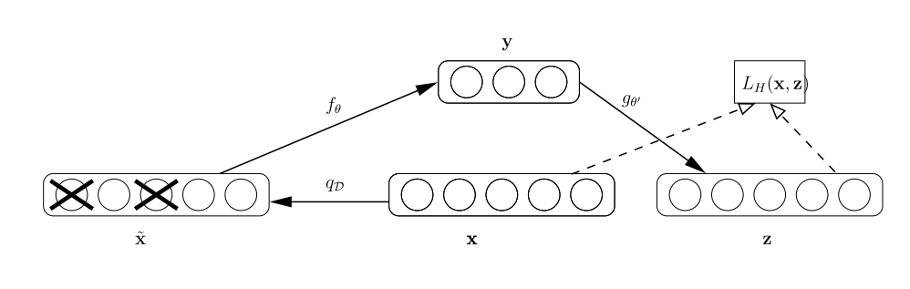
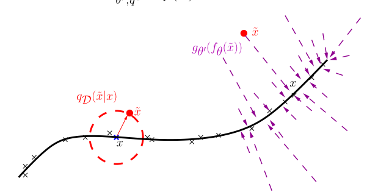

Bert作为2018年在自然语言处理方向最重要的突破，霸占各种比赛的榜单，引起了这个领域对于语言模型(Language Model, LM)的关注。虽然Bert不是作为第一个LM推出，也不是最优秀的一个（今年XLNET超越了Bert），但是它的影响力却是最大的。最近读到了一篇论文 [Extracting and Composing Robust Features with Denoising Autoencoders](http://www.cs.toronto.edu/~larocheh/publications/icml-2008-denoising-autoencoders.pdf)，发现Bert的思想与它十分相似。

## DENOSING AUTOENCODER

降噪自编码器(DAE)是有自编码器发展而来，用于提取具有鲁棒性的特征。

自编码器是一种无监督的学习方式，可以用于特征提取与降维，这是我最早学习的一个无监督学习算法：将输入x加权映射之后得到y,再对y通过方向加权映射成为z,通过优化x与z之间的似然函数或者误差函数，得到y。直观上，该过程如下：

> 输入特征 x -> 压缩表示 y -> 重构输入 z

如果用全连接神经网络来编码这个函数映射，可以容易的构建一个自编码机：构建多个全连接层，以其中一层隐藏层的神经元作为y，该层神经元的个数是你的特征的维度。该隐藏层之前的部分被称为编码部分，之后的部分称为解码部分。

降噪自编码器是在自编码器的基础之上，以一定的概率分布擦除输入，将该位置的输入置为0，看起来就像是丢失了部分特征，得到 $x^{'}$，然后通过 $x^{'}$来计算y与z，并在最后优化z与**初始x**之间的误差函数。

通过这样的破损的输入数据训练出来的Weight噪声比较小，这也是名称中降噪的来源，且通过破损的数据可以减小训练数据与测试数据之间的差别。

这样的破损数据对于人类的判别来说，是轻而易举的，比如一张部分模糊的老照片，人可以轻易地识别它的主要内容；给一段繁体汉字的文字，简体汉字使用者也能基本读出它的意思，这段文字中的大部分简繁同体的文字中，繁体汉字相当于破损的数据。这也许是降噪自编码器的初衷。

在这篇论文中，用流形学习的观点解释了降噪自编码器：

假定训练数据（×）聚集在一个低维流形附近，通过加入破损过程$q_D( \tilde{X}|X)$得到的破损的样本（ $\cdot$ ）会处在距离流形更远的位置。降噪自编码器通过学习$p(X|\tilde{X})$把他们*投影回*流形上。中间的压缩表示Y则可以解释为流形上的点的一个坐标系。

## BERT

Bert在预训练中任务之一是完型填空，也被称为“Masked LM”，将输入的句子按一定规则进行损坏：选取15%的输入词：在80%的情况下将单词用[MASK]字符替代，在10%的情况下将单词用一个其他随机单词替换，在10%的情况下不做任何替换。

该任务在训练中，他们的目的是预测这些用[MASK]字符替换的单词。由于模型不知道哪一个单词会被预测或者会被替代成随机的词汇，所以模型会被迫学习每一个输入单词的上下文表达。

与DAE相似的是，他们都使用了破损的输入，但是不同的是，DAE是在破损的输入之上重构原始的完整输入，而Bert却没有重构一个完整的输入，只是预测破损的词。

Masked LM与经典的DAE任务十分相似，通过对输入进行破损加工，然后通过从一定程度上重构原始的完整输入，从而得到特征。但是，这样做也有一定的缺陷， 今年的XLNet在论文中指出:

- 在预训练过程中人工加入的[Mask]在真实的语言数据中是缺失的，这会导致预训练与finetune之间的差异；

- 由于被预测的词汇是被遮盖的，所以BERT的假定是这个破损的词汇与其他没有被遮盖的词汇之间是相互独立的，而语言模型中一般是高阶的长程依赖，Bert可能过于简化了（也就是说XLNet吹了一波自己在长文上的表现比Bert好）

## THE END

总之，经典论文还是得看，SOTA的模型最开始的思想也许就是来自这些经典论文。
