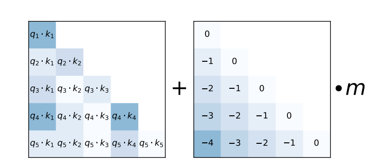
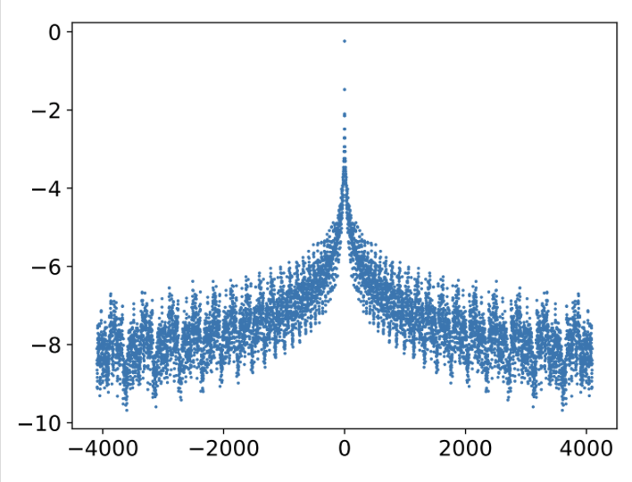

## ALiBi
	- [ALiBi](https://arxiv.org/pdf/2108.12409.pdf)在attention score上加入位置信息，在较短的句子上训练，在 infer 较长的句子时依然会有较好的效果
	- **### Attention with Linear Biases**
		- {:height 245, :width 560}
		- $$
		  \begin{equation}\boldsymbol{q}_m^{\top}\boldsymbol{k}_n - \lambda|m - n|\end{equation}
		  $$
	- ### code
	  collapsed:: true
		- ```python
		  
		  class AlibiPositionalBias(nn.Module):
		      def __init__(self, heads, **kwargs):
		          super().__init__()
		          self.heads = heads
		          slopes = torch.Tensor(self._get_slopes(heads))
		          slopes = rearrange(slopes, 'h -> h 1 1')
		          self.register_buffer('slopes', slopes, persistent=False)
		          self.register_buffer('bias', None, persistent=False)
		  
		      def get_bias(self, i, j, device):
		          i_arange = torch.arange(j - i, j, device=device)
		          j_arange = torch.arange(j, device=device)
		          bias = -torch.abs(rearrange(j_arange, 'j -> 1 1 j') - rearrange(i_arange, 'i -> 1 i 1'))
		          return bias
		  
		      @staticmethod
		      def _get_slopes(heads):
		          def get_slopes_power_of_2(n):
		              start = (2 ** (-2 ** -(math.log2(n) - 3)))
		              ratio = start
		              return [start * ratio ** i for i in range(n)]
		  
		          if math.log2(heads).is_integer():
		              return get_slopes_power_of_2(heads)
		  
		          closest_power_of_2 = 2 ** math.floor(math.log2(heads))
		          return get_slopes_power_of_2(closest_power_of_2) + get_slopes_power_of_2(2 * closest_power_of_2)[0::2][:heads - closest_power_of_2]
		      
		      def forward(self, qk_dots):
		          h, i, j, device = *qk_dots.shape[-3:], qk_dots.device
		          if exists(self.bias) and self.bias.shape[-1] >= j:
		              return qk_dots + self.bias[..., :i, :j]
		  
		          bias = self.get_bias(i, j, device)
		          bias = bias * self.slopes
		          num_heads_unalibied = h - bias.shape[0]
		          bias = F.pad(bias, (0, 0, 0, 0, 0, num_heads_unalibied))
		          self.register_buffer('bias', bias, persistent=False)
		          return qk_dots + self.bias
		  
		  ```
- ## Kerple
	- kerple 是Alibi 的简单推广，它引入了两个训练参数$$r_1, r_2$$来一般化式
		- $$
		  
		  \begin{equation}\left\{\begin{aligned}&\boldsymbol{q}_m^{\top}\boldsymbol{k}_n - r_1|m - n|^{r_2} ,\qquad\qquad r_1 >0, 0 < r_2 \leq 2\\ 
		  
		  &\boldsymbol{q}_m^{\top}\boldsymbol{k}_n - r_1\log(1+r_2|m - n|),\qquad\qquad r_1, r_2 > 0 
		  
		  \end{aligned}\right.\end{equation}
		  
		  $$
- ## Sandwich
	- $$
	  \begin{equation}\boldsymbol{q}_m^{\top}\boldsymbol{k}_n + \lambda\boldsymbol{p}_m^{\top}\boldsymbol{p}_n\end{equation}
	  $$
	- 其中$p_m,p_n$是Sinusoidal位置编码，$\lambda>0$是超参数。
	- $\boldsymbol{p}_m^{\top}\boldsymbol{p}_n$：
		- {:height 434, :width 607}