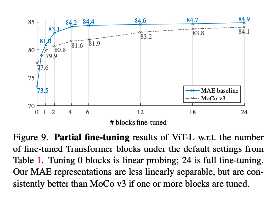
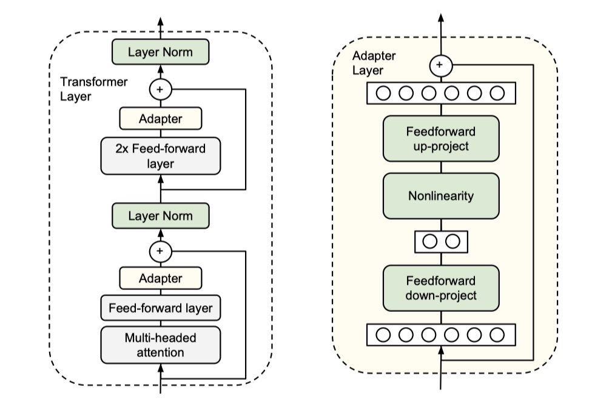
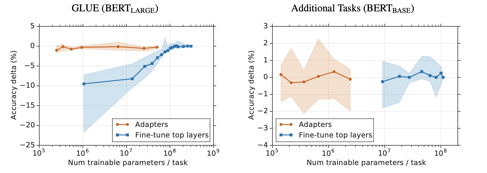
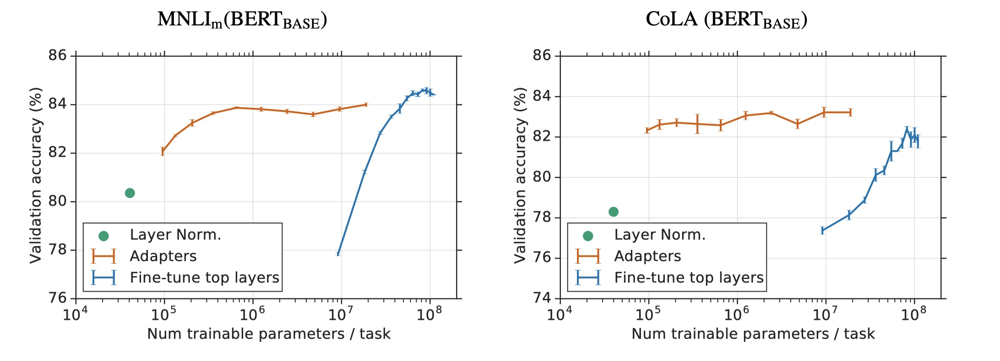

## Finetune
	- fine-tuning 指的是首先预训练模型，然后接入下游任务，将预训练阶段的权重作为 finetuning 的初始化权重，之后将下游任务与预训练部分一起训练，侧重的是 co-training。
	- 从[[MAE]]可以看出，与 BERT 相似的以 embedding 为主的预模型需要finetune以提升效果；
		- {:height 408, :width 548}
		- （但在NLP 预训练任务中，通常linear probing 不会用来评估预训练的结果的好坏）
- ## Adapter
	- Adapter-Bert 来源于 Google 的《Parameter-Efficient Transfer Learning for NLP》论文，主要目的在不降低模型效果的情况下，减小 finetune 时候的参数。
	- ### 模型架构
	  collapsed:: true
		- Apdater-Bert 的想法是将 task-specific layer 放在预训练模型中间，也就是加入 Adapter 结构，然后冻结住预训练模型参数，最后我们 fientuning 的时候，只更新 Apdater、layerNorm 以及与具体任务相关的 layer 的参数。具体结构图如下：
		- {:height 555, :width 508}
		  collapsed:: true
			- *左图**是 Adapter-BERT 中的 transformer layer，我们可以看到每一个 transformer layer 增加了两个 Adapter layer，分别加在 LayerNorm 之前，当然了，在进行 LayerNorm 之前，我们需要进行讲 Apdater layer 的输出进行残差连接。
			- **右图**是 Adapter layer 的具体结构示意。这个其实让我想到了 ALBERT 中的低秩因式分解。假设输入 input 的维度是 $d$ ，我们首先通过一个 FFN 让其维度变为 $m$ ，且 $m<<d$ ；之后再通过一个 FFN 得到输出结果 ouput，其其维度变为 $d$ 。最后，我们进行残差连接，即 input+output 作为 Adapter layer 的输出结果。另外，分析一下 Apdater layer 的参数，对于一个 transformer layer 来说，增加的参数是 2*(2dm+d+m+2d+2d)，其中 2d 表示是 LN 的参数量，增加的参数量占总的参数量的 3%。
			- 这里为什么要用残差连接？主要是因为当初始化的时候，权重都很小，残差连接可以保证模型输出与预训练模型相同。
	- ### 实验结果
	  collapsed:: true
		- 
		- 从结果来看基本上能接近 fine-tuning 的结果。
		- 
			- 对于 fine-tune 来说，减小训练的层数会大幅降低准确率；而对于 Adapter-based 来说，几乎没有什么影响；
		- 
			- Fine-tune layerNorm 没有什么用。
	- ### LLM adapter
		- 同样使用类似 model injection 的思路进行 PEFT 的方法：
			- [LLaMA-Adapter](https://github.com/ZrrSkywalker/LLaMA-Adapter)
- ## [[模板学习]]
- ## [[LoRA]]