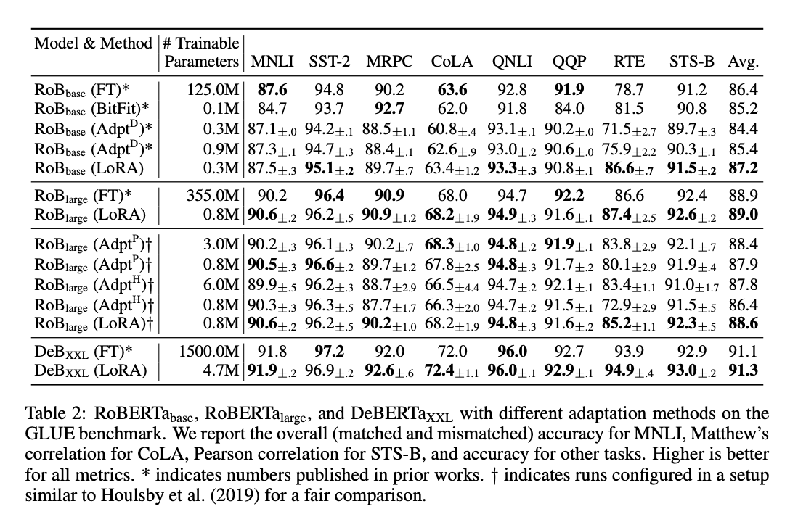

## LoRA
	- 直接实现 Adaptor 需要修改基座的网络结构，而 LoRA 对于预训练的参数矩阵 $$W_0\in R^{m \times n}$$ ，不直接微调 $$W_0$$ ，而是对增量做低秩分解假设：
		- $$W = W_0 + UV, U\in \mathbb{R}^{m \times r}, V \in \mathbb{R}^{r\times n}$$
		- 其中 $$U, V$$ 之一用全零初始化， $$W_0$$ 固定不变，优化器只优化 $$U,V$$ 。r 可以取得很小，甚至可以取 1。
		- 
- **## QLoRA**
	- https://github.com/artidoro/qlora
- **## ReLoRA**
	- https://arxiv.org/abs/2307.05695
	- https://github.com/Guitaricet/relora
- **## LongLoRA**
	- https://github.com/dvlab-research/LongLoRA
-