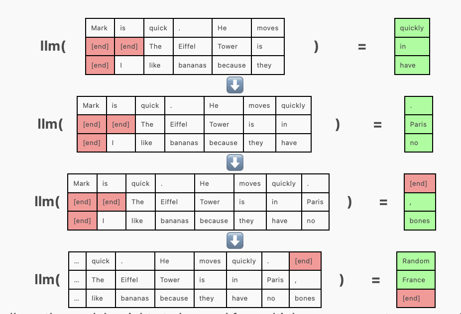
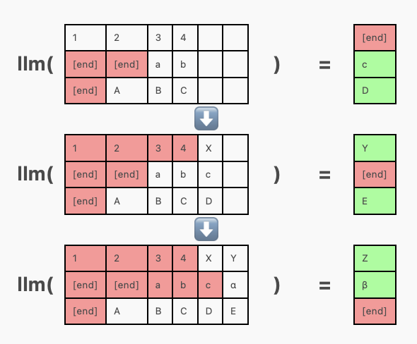

- DONE #read https://vgel.me/posts/faster-inference/
- ## torch.compile
	- 使用torch.compile加速算子
- ## Batching
	- left padding不同长度的句子
		- {:height 605, :width 702}
	- 好处：可以 batch 化的 inference
	- 坏处：在一个句子已经 [end] 时，依然需要不停地输出 random，会占用 GPU
- ## Continuous Batching
	- 在一个句子结束后 inference 下一个句子
		- {:height 496, :width 590}
- ## KVCache
	- [[KV Cache]]
- ## Multi Query Attention
	- [[Multi-Query Attention]] 节省参数与计算量
- ## PagedAttention
	- [[PagedAttention]] 将kv cache 切成小块管理，[[vllm]] 基于paged attention进行内存管理，加速inference。
- ## Speculative Decoding
	- [[speculative decoding]] 通过draft model 进行 decode ，同时利用 oracle model 进行纠错。由于 draft model 是小模型，于是可以大大加速inference 过程。
- ## flash attention
	- [[flash attention]]
- ## 量化模型
	- [[量化LLM]]