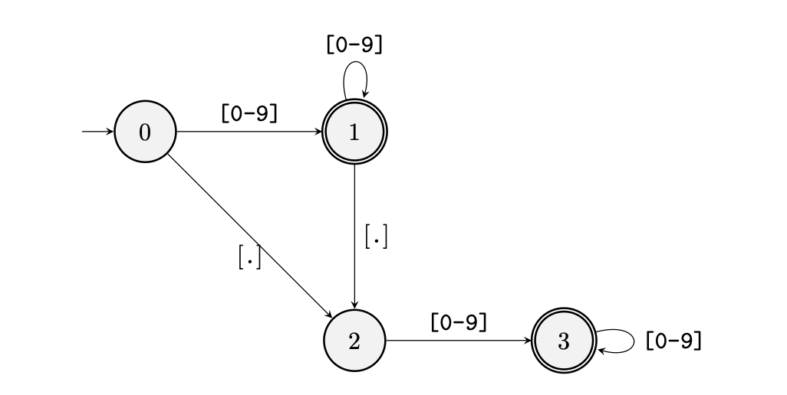

- 最近，我在用 GPT-4 生成特定的 JSON 时，没有使用 OpenAI 自带的 JSON 模式，结果发现生成的 JSON 格式有时并不标准。而当使用 instruct 能力较弱的模型时，我不想通过微调来实现模型生成特定格式的文本，我想起了之前看到的一个叫 Outlines 的工具声称让模型可以做特定格式的 guided generation，于是试用了一下，发现在我的模型上确实可以生成 JSON，于是看了一下 与代码。在论文中，Outlines 将大模型生成重新构建为有限状态机之间的转换，解决了在严格格式要求下引导 LLM 生成的问题。在现在模版工程比较流行时，在这个领域工作都会遇到的一个问题，尤其是 JSON 生成。
- ## 简化问题
- 为了简化，假设我们的模型的词表只有 5 个词：
- > "A", " ." , "42" , ".2" ,  "1"
- 如果我们需要使大模型生成一个满足`[0-9]*)?\.?[0-9]` 的浮点数，Outline 会建立起以下的有限状态机（FSM）
	- {:height 321, :width 655}
- 当开始产生时，FSM 在状态0，此时算法会 mask 词典中的非数字“A”，因为它不会被 FSM 所接受，此时其他四个数字都可以被采样；如果采样了“.2”，状态机将会到状态3，此时，只有“1”与“42”是合法的，其他不符合正则的字符在采样时将会被 mask；如果采样了“1”，状态要将转移到状态  1，此时，除了“A” 都是合法的采样，因此此时只会 mask “A”。
	- {:height 359, :width 655}
- 如上面所示，Outlines 使用的将 FSM 与 decoding 结合的方式的思路是简单有效的。
- ## 算法解读
- Outlines 使用正则表达式的有限状态机（FSM）对词汇表进行预处理，并建立一个索引。它会考虑从每一个可行的 FSM 状态开始，因为词汇表中的字符串可能匹配正则表达式的任意部分，而这些部分隐含地对应着 FSM 状态。下面的算法会通过遍历状态转移图，找到所有可以接受输入字符串的路径，并将这些路径作为子序列返回。每当遇到无法继续转移的状态时，算法会尝试下一个可能的起始状态。
- ```
  function FIND_SUB_SEQUENCES(M, v)
  	M = (Q, Σ, δ, q0, F)
      res ← ()                      // 初始化结果集为空
      for r ∈ δ^(-1)(., v0) do      // 遍历所有可以读取 v0 的状态
        p ← (r)                     // 初始化路径
        for i ← 1, |v| - 1 do       // 遍历字符串 v 的每个字符
            if δ(r, vi) = ∅ then    // 检查是否有转移
                p ← ()              // 无转移，清空路径
                break               // 中断循环
            end if
            r ← δ(r, vi)            // 更新状态
            p ← append(p, r)        // 路径中追加状态
        end for
        res ← append(res, p)        // 将路径添加到结果集
  	end for
      return res                    // 返回结果集
  end function
  ```
- 遍历词汇表来确定有效的未来状态仍然会带来较大的计算开销，而 outlines的 FSM 在给定约束条件下被预先计算，并创建了状态转移的索引。下面的算法通过遍历词汇表中的每个词，找到所有能够接受该词的子序列，并根据子序列的初始状态构建一个映射，将词汇与 FSM 的状态关联起来。Outlines 会在解码开始时一次性缓存，从而在每次解码时不需要额外耗时。
- ```
  function MAP_STATES_TO_VOCAB(M, V)
  	M = (Q, Σ, δ, q0, F)  
  	Initialize the map σ with empty sets for each element in Q  
  	for v ∈ V do                      // 遍历词汇表  
  		Z ← find_sub_sequences(M, v)  // 查找接受 v 的子序列  
  		for z ∈ Z do                  // 遍历每个子序列  
  			σ(z0) ← σ(z0) ∪ v         // 将 v 加入到对应的集合中  
  		end for  
  	end for  
  	return σ                           // 返回映射  
  end function
  ```
- 结合到 LLM 的 decode 部分，在 mask 时，由于有了上述 FSM 的提前缓存，因此 mask 步骤只需要 $$O(1)$$的时间。
- ```
  function SAMPLE_TOKENS(L)
  	s ← ()                                 // 初始化空序列
  	for i ← 1, L do                        // 遍历 token 的序列长度
  		α ← LLM(s, θ)                      // 根据当前序列和模型参数生成预测分布
  		Construct the mask m(s)            // 构建掩码
  		ã ← m ⊙ α                         // 将掩码应用到预测分布
  		Sample  ̃s ~ Categorical(ã)        // 从新的分布中采样下一个令牌
  		if  ̃s = EOS then                  // 如果采样到结束符
  			break                          // 中断循环
  		end if
  		s ← append(s, ̃s)                  // 将采样到的令牌添加到序列
  	end for
  	return s                                // 返回生成的序列
  end function
  
  ```
- ## 加速 LLM
- 在另一个[博客](https://vgel.me/posts/faster-inference/#openai-json-mode)中，有提到 Outlines 用来进行加速 LLM，除了在生成固定格式时，由于固定格式的存在，在生成 JSON 数据时，只有一部分来自模型的输出，而更多的时候会被 FSM 自动插入字符，节约了一大笔 token 数，如在生成下列固定 key 的 json时：
- {
    "name": "clerame",    (4 ambiguous tokens: cl er ame ",\n)
    "age": 7,             (2 ambiguous tokens: 7 ,\n)
    "armor": "plate",     (1 ambiguous token:  plate)
    "weapon": "mace",     (1 ambiguous token:  m)
    "strength": 4171      (3 ambiguous tokens: 417 1 \n)
  }
- 共 41 个 tokens，但只有 11  个token 需要从模型中产生。
-
- ## 相关
- https://lilianweng.github.io/posts/2021-01-02-controllable-text-generation/