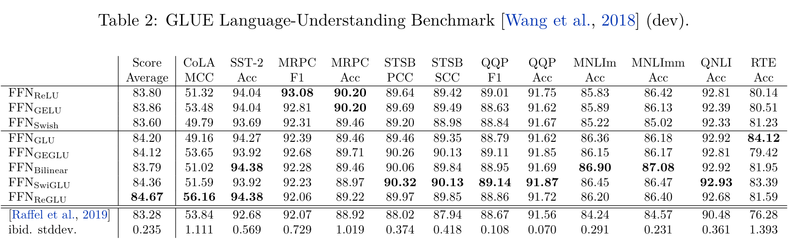
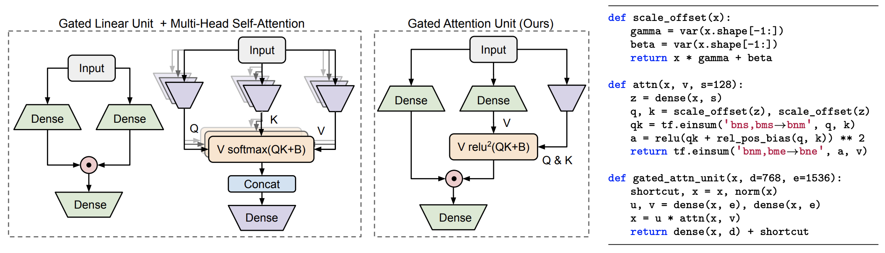

- 传统的 transformer 中在注意力机制之间使用 FFN 进行连接，
	- $$FFN(x, W_1, W_2, b_1, b_2) = ReLU(xW_1 + b_1) W_2 + b_2$$
	- 按 [[T5]] 的实现，FFN 为无 bias 的版本
- ## GLU 门控线性单元
	- GLU  为门控线性单元，现在被广泛地使用于大模型中用于替换 FFN，如 [[LLAMA]]、 [[Mistral]] 中均使用了 GLU 取代了 FFN
	- ### GEGLU
		- $$GEGLU(x, W, V, b, c) = GELU(xW+b)\odot(xV+c)$$
	- ### SwiGLU
		- $$ \text{SwiGLU}\left(x, W, V, b, c, \beta\right) = \text{Swish}_{\beta}\left(xW + b\right) \otimes \left(xV + c\right) $$
	- $GELU =x \Phi(x)$ 与 $Swish_\beta(x) = x \sigma(\beta x)$ 为两类激活函数。Google 曾经使用多种激活函数的变种进行门控线性单元的实验，并指出这些变种在迁移学习的设置下，对于预训练中的去噪的目标函数，产生的perplexity更低，且下游任务的效果更好。
		- 
- ## GAU 门控注意力单元
	- GAU 由谷歌 论文中提出，结合 GLU 与 attention。
		- $$
		  
		  \begin{equation}\boldsymbol{O}=(\boldsymbol{U}\odot\boldsymbol{V})\boldsymbol{W}_o,\quad \boldsymbol{U}=\phi_u(\boldsymbol{X}\boldsymbol{W}_u),\quad\boldsymbol{V}=\phi_v(\boldsymbol{X}\boldsymbol{W}_v)\end{equation}
		  
		  $$
	- {:height 253, :width 856}
	- GAU 在线性化注意力机制，速度更快，内存更省。