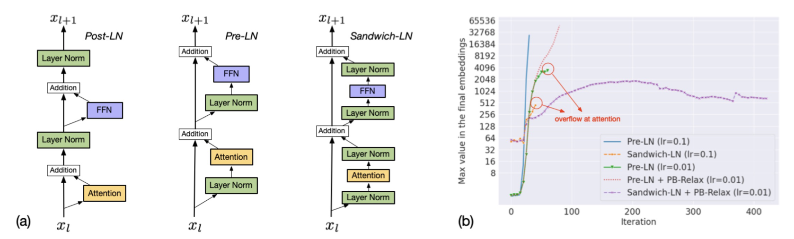

- **## pre norm / post norm / sandwich ln**
	- 原始的 BERT 论文采用 Post-LN 结构，而Post-LN 结构容易发散，近年来大模型多用Pre-LN结构
	- 数百亿/多模态混合精度训练(FP16)中，Pre-LN 也不稳定， Sandwich-LN可以缓解这个现象
	- 
- ## Deep Norm
	- $$DeepNorm(x) = LayerNorm(\alpha \cdot x + Network(x))$$ , 其中 $$\alpha = (2N)^{\frac{1}{2}}$$
- ## [RMSNorm](https://arxiv.org/abs/1910.07467)
	- 与 Layer Norm 相比，少减去均值，可节省训练所需时间
		- $$RMS(a) = \sqrt{\frac{1}{n} \sum_{i=1}^n a_i^2}$$
		- $$\bar{a}_i = \frac{a_i}{RMS(a)}$$
		- 此外，RMSNorm 还可以引入可学习的缩放因子$g_i$和偏移参数$b_i$, 从而得到$\bar{a}_i = \frac{a_i}{RMS(a)}g_i + b_i$
	- ```python
	  def rms_norm(x, weight=None, eps=1e-05):
	      output = x * torch.rsqrt(x.pow(2).mean(-1, keepdim=True) + eps)
	      if weight is not None:
	          return output * weight
	      return output
	  ```