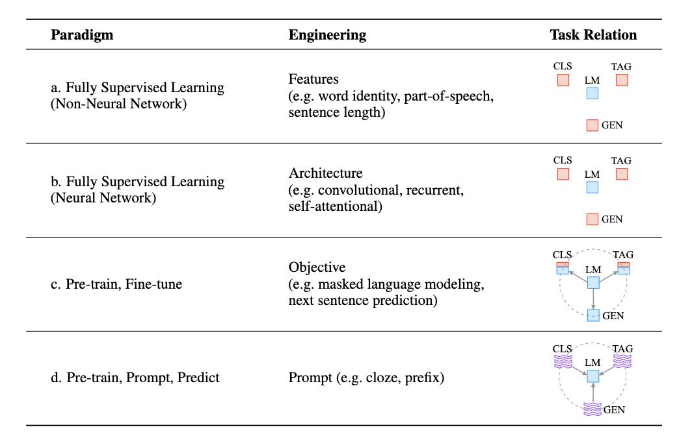
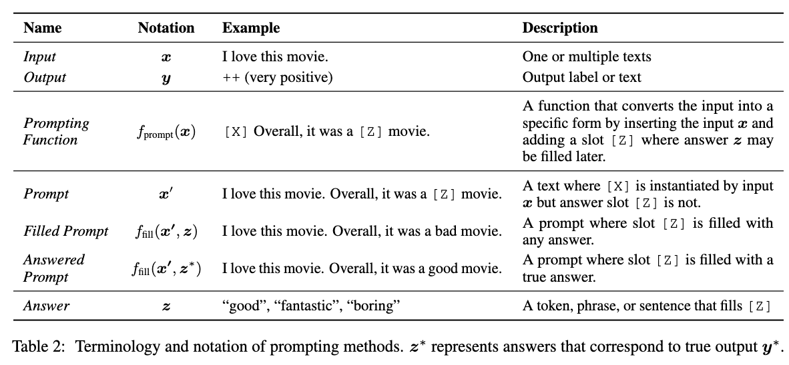
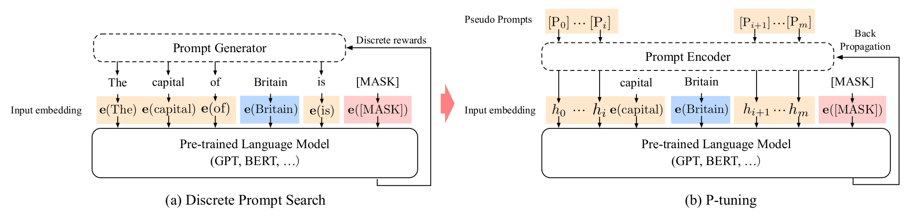

## 思路
	- {:height 399, :width 543}
	- prompt将原来的输入文本填入一个带有输入与输出槽位的模板，然后利用预训练语言模型预测整个句子，最终利用出这个句子推导出最终的答案。
	- prompt在利用预训练的基础之上，定制合适的模板，这种方式可以轻易地完成 few-shot 或者 zero-shot 任务。从数学的角度来看，监督学习是建模 $P(y|x;\theta)$，而 prompt 则是建模 $P(x;\theta)$，通过模型告诉我们输入文本 x 出现的概率，然后利用这个概率去预测正确的 y，这样其实可以减少需要标注的数据。
		- {:height 264, :width 554}
	- 对比预训练模型与模板学习, [[预训练与语言模型]] 是通过语言模型衔接下接任务进行微调，而模板学习是将下流任务融合到语言模型中。
- ## Prompt 工程
	- prompt 工程是指找到一个模板函数 $f_{prompt}(x)$能够将输入应用到下游任务上，并取得很好的效果。prompt 通常有两种最常见的形式，一种是完形填空式(cloze prompts)；另一种是前缀式模板(prefix prompts)。
	  id:: 6447e9d7-8670-4899-8369-22d4f70c6fec
	- **人工模板工程**通过人工设计启发式的模板，例如LAMA数据集设计了完形填空式的模板。但是与特征工程类似地，人工模板需要时间与经验，对于一些复杂的任务，如语义解析，则需要专家级的设计者。
	- **自动模板学习**可以细分离散模板(discrete prompts)，离散模板是实际的文本字符串。另一种是连续模板(continuous prompts)，是指上是在底层的语言模型中的嵌入空间中进行描述。连续模板移除了两个限制：一是放松了模板词只能选择有限的自然语言词的限制；二是移除了模板参数公能读取自 LM 模型的限制，也就是说模型也能有自己的参数，并根据下游任务进行训练。
		- Prefix Tuning , Prompt Tuning 与 P-Tuning
			- Prefix tuning ：在输入前加入与任务相关的连续前缀向量，这个前缀向量是可训练的，而后续的 LM 模型参数则是冻结的。其实质是优化在给定可训练矩阵 $M_{\phi}$ 和固定预训练语言模型 $\theta$ 下的一个对数似然函数：
				- $$\max_\phi \log P(y|x;\theta;\phi) = \max_\phi \sum_{y_i} log P(y_i|h_{\lt i};\theta; \phi) $$
				- Prefix Tuning 会在每个 transformer 层以及输入层预先设置一系列前缀。实现上 huggingface 通过 `past_key_values` 对 prefix 部分以缓存的形式拼接到 transformer 的每一层中，`P-Tuning V2` 采用了类似的实现。
			- Prompt Tuning：利用离散模板作为初始化，然后将其连续化。即先定义一个基于 virtual tokens 的离散模板，然后微调 embedding 来使任务效果更好。通过在输入嵌入前添加提示来表示任务来实现。只 finetune token embedding；
			- P-Tuning：结合了 prefix tuning 与 prompt tuning，利用离散模版作为初始化，将其使用 encoder (LSTM 或者 MLP)连续化后，将一些可微调的 embedding 插入到固定的模板中。
				- {:height 243, :width 958}
				- P-Tuning 采用的也是参数化的 Prompt，与 Discrete Prompt 的区别：
					- 假设原输入为: $T=\{[P_{0:i}],x,[P_{i+1:m}],y\}$。
					- Discrete Prompt 使用 PLM 的 embedding 层 $e(\cdot)$ 将原输入编码成 $\{e([P_{0:i}]),e(x),e([P_{i+1:m}]),e(y)\}$， 此处的每个 P 对应一个token，如（a）所示；
					- 而 P-Tuning 则使用可学习的参数替代，将原输入编码为$\{h_0,…,h_i,e(x),h_{i+1},…,h_m,e(y)\}$ ，此处 P 为pseudo token，并没有实际指向的token。
				- 与 Prefix Tuning 的区别：
					- P-Tuning 的 prompt 字符可加入在任何位置；
					- P-Tuning prompt 的编码将与其他 embedding 一起传入预训练模型中，而不是加在模型的每一层前；
					- 引入了 anchor token；
				- [P-tuning 实现](https://kexue.fm/archives/8295)