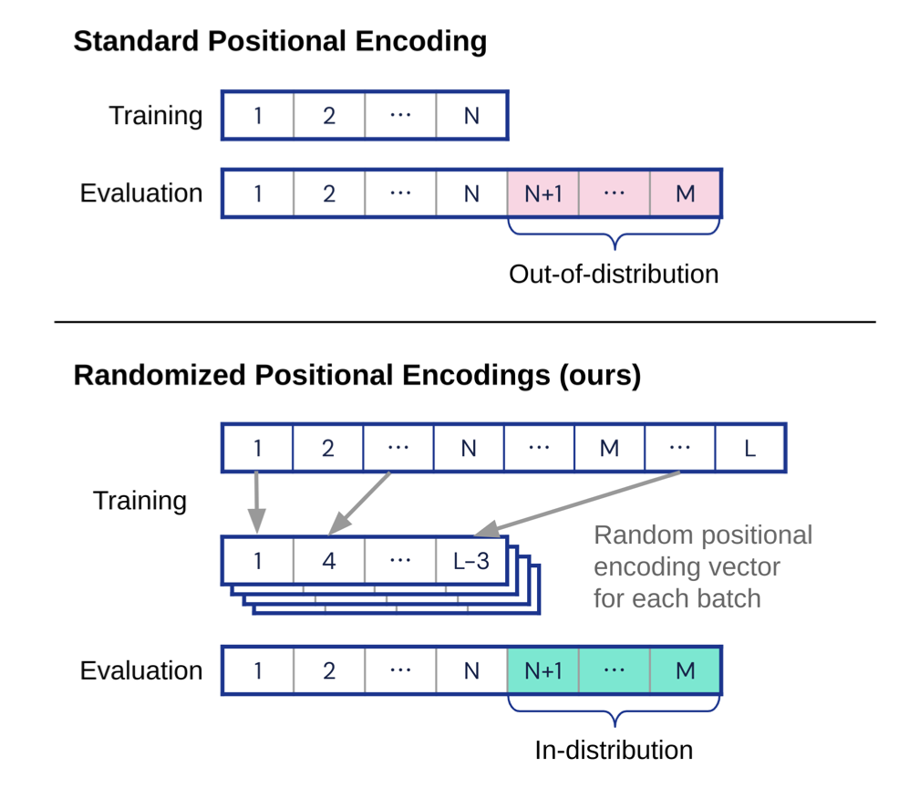
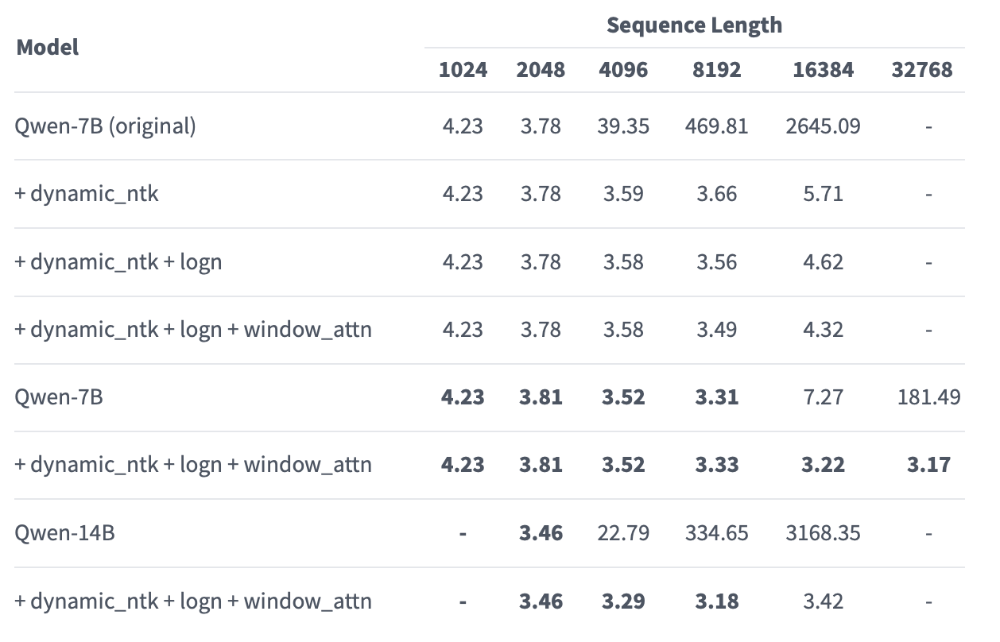
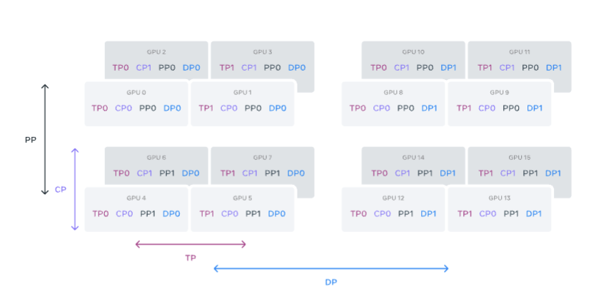

## 问题
为什么对于模型来说扩展到更长的序列长度上会比较难？
distracting tokens EOS 等使模型效果变差
> Our analysis in Section 4 indicates that length generalization pathologies persist even when we use the padded scratchpad strategy that makes sure that it’s not untrained position encodings and/or the EOS token prediction that causes the aforementioned pathologies. This points to the fact that the transformer doesn’t learn to attend to the “right” section of the input and scratchpad that implements the sequential strategy that generalizes to longer lengths — it’s thrown off by distractor tokens in the input and/or the preceding scratchpad targets. [Anil](https://arxiv.org/abs/2207.04901)

更后面的位置编码更新的次数少于前面的位置编码
> If the network is only trained with short instances, position biases that handle longer positional distances might not be trained, explaining poor length generalization. [Tao](https://arxiv.org/abs/2305.04859)

在位置编码中的 bias 会复制窗口注意力机制的效果，会通过使长距离感受域的标记间依赖性衰减
> Intuitively, ALiBi encourages a token to focus on neighbors based on its temporal biases ma- trix. When two tokens are distant, ALiBi becomes highly similar to windowed attention[Chi](https://arxiv.org/abs/2212.10356)

使用线性位置编码时，为了让模型能够处理任意长度的序列，需要让查询向量和键向量之间的注意力权重不依赖于序列的总长度，而只由 token 之间的相对位置决定。而这一现象往往是理想情况下。
> Proposition 4. Consider linear positional encoding, i.e. pi = i/C for some (large) constant C. Then, perfect length generalization to arbitrary length requires $W_T W_{Kp} = 0$ . [Liu](https://arxiv.org/pdf/2306.00946.pdf)

位置编码没有外推性
> 在直觉上，相信很多读者觉得像[Sinusoidal](https://kexue.fm/archives/8231)或[RoPE](https://kexue.fm/archives/8265)之类的函数式位置编码，它们没有训练参数，长度外推性应该很好才对，但事实上并非如此，这类位置编码并没有在长度外推方面表现出什么优势。为什么会这样呢？其实是大家在假设函数式位置编码的外推性时，忘了它的基本前提——“光滑性”。 
> 其实，外推性就是局部推断整体，对此我们应该并不陌生，泰勒级数近似就是经典的例子，它只需要知道函数某点处若干阶导数的值，就可以对一个邻域内的值做有效估计，它依赖的就是给定函数的高阶光滑性（高阶导数存在且有界）。但是[Sinusoidal](https://kexue.fm/archives/8231)或[RoPE](https://kexue.fm/archives/8265)是这种函数吗？并不是。它们是一系列正余弦函数的组合，其相位函数是k/100002i/d，当2i/d≈0时，函数近似就是sink,cosk，这算是关于位置编码k的高频振荡函数了，而不是直线或者渐近趋于直线之类的函数，所以基于它的模型往往外推行为难以预估。能否设计不振荡的位置编码？很难，位置编码函数如果不振荡，那么往往缺乏足够的容量去编码足够多的位置信息，也就是某种意义上来说，位置编码函数的复杂性本身也是编码位置的要求。 [Su](https://kexue.fm/archives/9431)
- ## Transformer 网络
  对于transformer来说，直接使用增加 context 长度会导致时间 $O(L^2d)$ 与显存 $O(L^2)$ ，直接增长训练数据是不太现实的，所以通过改进网络结构，来实现让语言模型理解更长的输入，参看 [[Transformer Family]]
  Longer Context
  
  除以log N 调整 attention值， N为输入序列长度 #logNscaling
  > Although this is not a logical consequence of Hahn’s lemma, it is a consequence of the behavior that Hahn’s lemma predicts. Fortunately, this problem can be fixed with a simple modification, multiplying attention logits by log 𝑛. This modification also improves length generalization in machine translation. [Chiang](https://arxiv.org/pdf/2202.12172.pdf)
  
  使用 ReLU 替换 attention 中的 softmax (模型不一定收敛)
  > By changing the total number of key-value slots, we find that ReLU performs better than Softmax when the number of slots is larger. We explore the reason by calculating the ratio of top scores among all activations and find that the activation weights are highly centralized in a small number of slots, thus insufficient to utilize the context information of other slots, while ReLU is able to alleviate this problem. Given the superior performance of ReLU when scaling to a large number of value slots, we then explore how ReLU performs on SAN where Softmax may have a trouble modeling long-sequences (Sun et al., 2022). Unfortunately, directly alternating Softmax to ReLU does not converge. With theoretical and experimental analysis, we find that the variance of SAN results with ReLU activation grows with the length of the input sequence, and the dynamic variance will lead to an unstable training process. Therefore, a variance reduction factor and regularization loss functions are introduced to solve this problem. As a result, we make it possible to utilize ReLU on self-attention, which performs better than Softmax when dealing with long input sequences. [Shen](https://arxiv.org/abs/2302.06461)
- ## 位置编码
  
  [[ALiBi, Kerple and Sandwich]] #窗口注意力
  
  [[RoPE]] 展现了比 Sinusoidal 更好的外推性, [[NTK-RoPE]] 优化了外推性 #ntk
  
  [Randomized Positional Encodings](https://github.com/deepmind/randomized_positional_encodings)  （ACL 2023）
  > We assume that each training step will perform a step of loss minimization on a batch of data of fixed size. Let `U(S)` denote the discrete uniform distribution over set `S`, and let `Pk := {S ⊆ {1, . . . , L}` | |`S`| = `k`}. For each training step, we first sample a random length `n ∼ U({1, . . . , N})` (following Delétang et al., 2023) and then a random set of indices `I ∼ U(Pn)`. We then sort `I` in ascending order, such that `I = {i1, . . . , in} for i1 < i2 < · · · < in`, noting that `I` is sampled without replacement. Finally, we compute our randomized positional encoding for token `1 ≤ j ≤ N` as `RPE(j, ·) := PE(ij , ·)`. At test time, when processing a sequence of length `M > N`, we use the same procedure but for all token positions `1 ≤ j ≤ M`. The intuition behind our method is to preserve the known good properties of relative encoding but in a way that is independent of the maximum training length N and thus allows generalization to longer sequences at test time. [Ruoss](https://arxiv.org/abs/2305.16843)
  {:height 316, :width 374}
  
  位置内插： 将 inference 时的长文本乘以因子 $$L_{train}/L_{test}$$
  > Therefore, instead of extrapolate the attention score in Eqn. 3 to s > L, how about we define an attention score $\tilde{a}(s) = a(Ls/L′)$ where L′ is the longer context window? Formally, we replace RoPE f by f′ defined as follows $f(x,m) = f (x, mL/L')$ [Chen from Meta](https://arxiv.org/pdf/2306.15595.pdf)
  
  
  QWEN1 
  {:height 420, :width 517}
  
  QWEN2 [[Dual chunk attention with YARN]]
- ## Context Parallel
  LLAMA 3.1 中使用了上下文并行（CP）来提高在扩展 Llama 3 的上下文长度时的内存效率，并使其能够在长度高达 128K 的极长序列上进行训练。在 CP 中，沿着序列维度进行划分，将输入序列划分为 2 × CP 个块，使得每个 CP 级别可以接收到两个块，以便更好地进行负载平衡。第 i 个 CP 级别将接收到第 i 个块和第 (2 × CP − 1 − i) 个块。
  换句话说，在预训练的时候通过切片 context 来完成长文本的训练：
  {:height 380, :width 710}
- ## 模版工程
  > 通过[[CoT]]和标记式标记的方式，可以引导预训练模型学习如何进行长度外推。模型在总结完成任务的步骤并标记完成状态的过程中，学习到了如何在上下文中利用更长的上下文信息进行推理。[Bueno](https://arxiv.org/abs/2208.11445)
  [[Longer Context Prompting and Retrieval Augment Generation]]
- ## Helpful Links
  https://kaiokendev.github.io/context
  https://kaiokendev.github.io/til
  https://spaces.ac.cn/archives/9948
  rerope：https://spaces.ac.cn/archives/9708